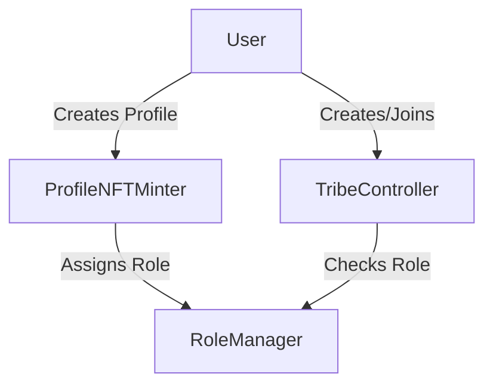
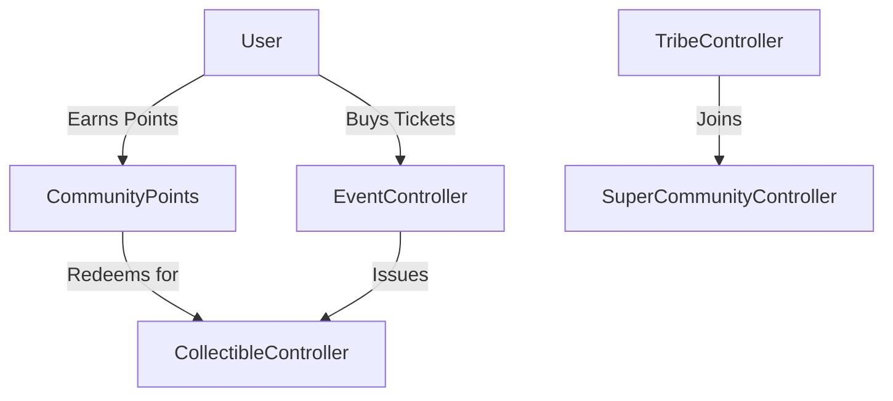
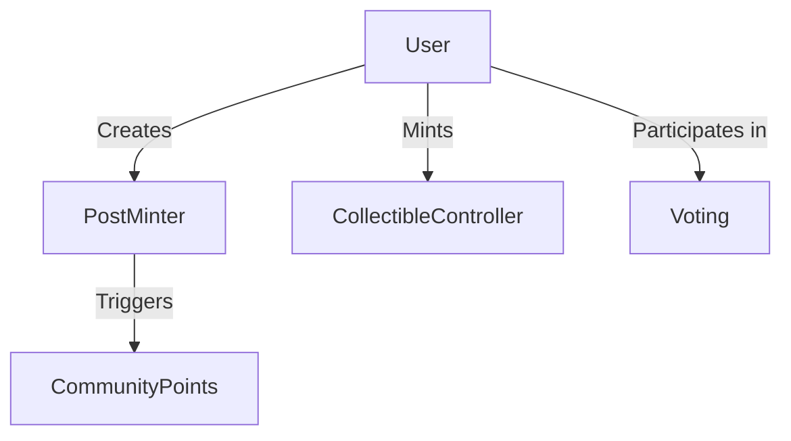

# Tribes by Astrix

A decentralized platform for community management and engagement, featuring points, events, and super communities.

## Project Structure

```
tribes-by-astrix/
  ├─ contracts/
  │   ├─ core/
  │   │   ├─ RoleManager.sol          # Role-based access control
  │   │   ├─ ProfileNFTMinter.sol     # Profile NFT management
  │   │   └─ TribeController.sol      # Tribe creation and management
  │   ├─ community/
  │   │   ├─ CommunityPoints.sol      # Points system & redemption
  │   │   ├─ EventController.sol      # Event & ticket management
  │   │   └─ SuperCommunityController.sol # Multi-tribe management
  │   ├─ content/
  │   │   ├─ PostMinter.sol          # Content posting
  │   │   ├─ CollectibleController.sol # NFT collectibles
  │   │   └─ Voting.sol              # Governance
  │   └─ interfaces/
  │       ├─ ITribeController.sol
  │       ├─ IEventController.sol
  │       └─ ICommunityPoints.sol
  ├─ test/
  │   ├─ core/
  │   │   ├─ RoleManager.test.ts
  │   │   ├─ ProfileNFTMinter.test.ts
  │   │   └─ TribeController.test.ts
  │   ├─ community/
  │   │   ├─ CommunityPoints.test.ts
  │   │   ├─ EventController.test.ts
  │   │   └─ SuperCommunityController.test.ts
  │   └─ content/
  │       ├─ PostMinter.test.ts
  │       ├─ CollectibleController.test.ts
  │       └─ Voting.test.ts
  ├─ scripts/
  │   └─ deploy.ts
  ├─ docs/
  │   ├─ UserJourney.md
  │   ├─ Architecture.md
  │   └─ API.md
  ├─ hardhat.config.ts
  └─ package.json
```

## Core Components & Flow

### 1. Core Layer


- **RoleManager.sol**: Central authority for role-based access control
  - Roles: FAN, ORGANIZER, ARTIST, BRAND, MODERATOR
  - Hierarchical permissions system
  - Role inheritance and management

- **ProfileNFTMinter.sol**: User identity management
  - ERC721-based profile NFTs
  - Immutable username
  - Metadata management (avatar, bio)
  - Automatic FAN role assignment

- **TribeController.sol**: Base community management
  - Tribe creation and configuration
  - Whitelist-based membership
  - Admin controls
  - Parent-child tribe relationships

### 2. Community Layer


- **CommunityPoints.sol**: Points system (New)
  - Off-chain points tracking
  - On-chain redemption with signatures
  - Anti-replay protection
  - Points-to-collectibles conversion

- **EventController.sol**: Event management (New)
  - ERC1155-based ticketing
  - One-time transfer restriction
  - Attendance tracking
  - Event lifecycle

- **SuperCommunityController.sol**: Multi-tribe management (New)
  - Tribe grouping and hierarchy
  - Cross-tribe operations
  - Unified governance
  - Member aggregation

### 3. Content Layer


- **PostMinter.sol**: Content creation
  - Post creation and management
  - Tribe-specific content
  - Point earning triggers

- **CollectibleController.sol**: NFT management
  - ERC1155 collectibles
  - Event tickets
  - Limited editions
  - Redemption mechanics

- **Voting.sol**: Governance
  - Proposal creation
  - Voting mechanics
  - Role-based voting weight
  - Execution tracking

## Key Features

### 1. Points System
- Off-chain points earning
- Signature-based redemption
- Collectible rewards
- Activity tracking

### 2. Event Management
- Ticket minting
- Transfer restrictions
- Attendance tracking
- Event lifecycle

### 3. Super Communities
- Multi-tribe management
- Hierarchical structure
- Cross-tribe operations
- Unified governance

### 4. Security Features
- Role-Based Access Control (RBAC)
- Signature verification
- Transfer restrictions
- Rate limiting

## Test Coverage Summary

### Test Status (Latest Run)
- Total Tests: 116
- Passing: 116 (100%)
- Failing: 0 (0%)

### Test Categories Coverage
1. **Core Functionality**
   - Profile Creation & Management: ✅ 
   - Username Validation & Uniqueness: ✅
   - Role-Based Access Control: ✅
   - Token Management: ✅

2. **Community Features**
   - Tribe Management: ✅
   - Super Communities: ✅
   - Events & Ticketing: ✅
   - Points System: ✅

3. **Content & Governance**
   - Post Creation: ✅
   - Voting System: ✅
   - Collectibles: ✅

4. **Security & Scalability**
   - Concurrency Handling: ✅
   - Access Control: ✅
   - Data Validation: ✅

5. **Super Community Analytics**
   - Should track all member tribes: ✅
   - Should track tribe additions and removals: ✅
   - Should maintain accurate tribe-to-community mapping: ✅
   - Should track metadata updates: ✅
   - Should maintain admin access control: ✅

6. **Collectible Management**
   - Should allow whitelisted user to mint collectible: ✅
   - Should revert when non-whitelisted user tries to mint: ✅
   - Should verify preconditions correctly: ✅
   - Should generate unique session keys: ✅
   - Should generate different keys for different parameters: ✅
   - Should emit WhitelistUpdated event: ✅
   - Should create a free collectible: ✅
   - Should create a paid collectible: ✅
   - Should create a points-gated collectible: ✅
   - Should claim free collectible: ✅
   - Should purchase paid collectible: ✅
   - Should claim points-gated collectible: ✅
   - Should handle supply limits: ✅
   - Should handle insufficient points: ✅
   - Should handle insufficient payment: ✅

7. **Community Points**
   - Should allow point redemption with valid signature: ✅
   - Should reject redemption with invalid signature: ✅
   - Should prevent replay attacks: ✅
   - Should allow admin to update verifier: ✅
   - Should prevent non-admin from updating verifier: ✅

8. **Event Management**
   - Should allow organizer to create event: ✅
   - Should prevent non-organizer from creating event: ✅
   - Should allow user to purchase tickets: ✅
   - Should refund excess payment: ✅
   - Should prevent purchase when not enough tickets available: ✅
   - Should prevent purchase with insufficient payment: ✅
   - Should allow first transfer: ✅
   - Should prevent second transfer: ✅
   - Should track transfer status correctly: ✅
   - Should handle batch transfers correctly: ✅
   - Should allow organizer to update metadata: ✅
   - Should prevent non-organizer from updating metadata: ✅
   - Should allow organizer to cancel event: ✅
   - Should prevent ticket purchase after cancellation: ✅

9. **Profile Management**
   - Should allow creating a profile: ✅
   - Should prevent duplicate usernames: ✅
   - Should allow owner to update profile metadata: ✅
   - Should prevent non-owner from updating metadata: ✅
   - Should correctly track username availability: ✅
   - Should handle username case sensitivity correctly: ✅
   - Should validate username format: ✅
   - Should return correct profile data: ✅
   - Should return correct token ID by username: ✅
   - Should handle queries for non-existent profiles: ✅

10. **Role Management**
    - Should assign roles correctly: ✅
    - Should remove roles correctly: ✅
    - Should only allow admin to assign roles: ✅
    - Should check for any role correctly: ✅
    - Should check for all roles correctly: ✅
    - Should get user roles correctly: ✅
    - Should allow admin to assign fan role: ✅
    - Should not allow non-admin to assign fan role: ✅

11. **Voting**
    - Should allow creating a proposal: ✅
    - Should increment proposalId after each creation: ✅
    - Should allow voting on proposal: ✅
    - Should track vote counts correctly: ✅
    - Should emit vote event regardless of vote choice: ✅
    - Should only count positive votes: ✅

## Development

### Setup
```bash
# Install dependencies
npm install

# Install dev dependencies
npm install --save-dev @openzeppelin/contracts @nomicfoundation/hardhat-toolbox

# Compile contracts
npx hardhat compile

# Run tests
npx hardhat test
```

### Deployment
```bash
# Set up environment variables in .env
PRIVATE_KEY=your_private_key_here

# Deploy to Monad Devnet
npx hardhat run scripts/deploy.ts --network monadDevnet
```

#### Network Details
- **Network Name**: Monad Devnet
- **Chain ID**: 20143
- **Currency Symbol**: DMON
- **RPC URL**: rpc-devnet.monadinfra.com/rpc/api-key
- **Gas Price**: 52 GWEI

#### Deployment Order
1. Deploy RoleManager
2. Deploy TribeController
3. Deploy SuperCommunityController (requires RoleManager and TribeController addresses)
4. Deploy EventController (requires RoleManager address)
5. Deploy CommunityPoints (requires RoleManager address)
6. Deploy remaining contracts with their dependencies

#### Post Deployment
After deployment, verify the contract addresses and update them in your frontend configuration.

### Testing
```bash
# Run specific test suite
npx hardhat test test/community/CommunityPoints.test.ts

# Run all tests
npx hardhat test

# Generate coverage
npx hardhat coverage
```

## Documentation
- [User Journeys](./docs/UserJourney.md)
- [Architecture](./docs/Architecture.md)
- [API Documentation](./docs/API.md)

## License
MIT
