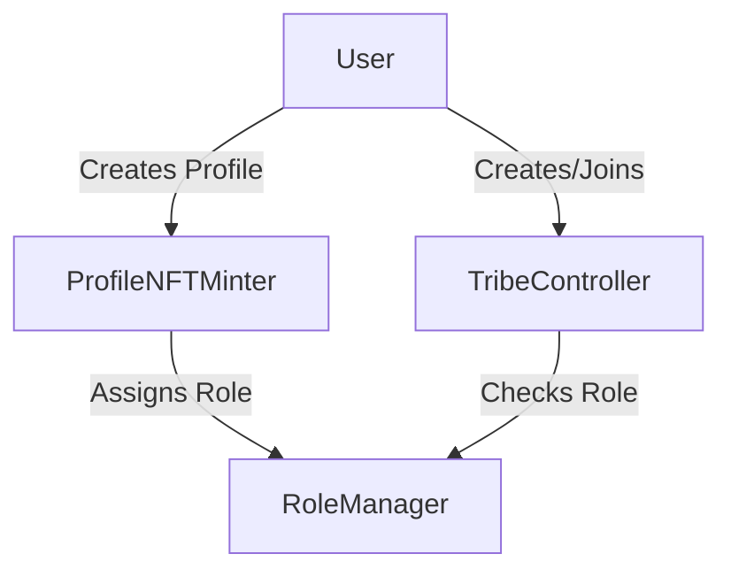
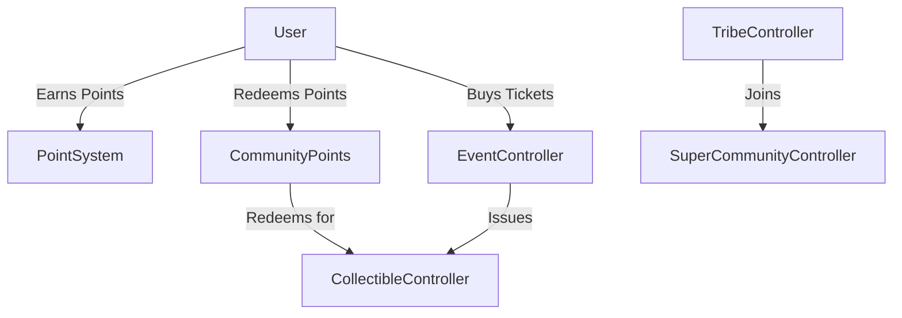
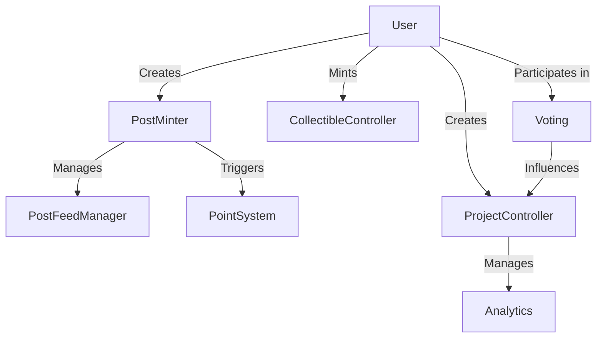

# Tribes by Astrix

A decentralized platform for community management and engagement, featuring points, events, and super communities. Built for both web3 natives and newcomers, Tribes by Astrix enables vibrant digital communities with powerful on-chain tools.

## Project Structure

```
tribes-by-astrix/
  ├─ contracts/
  │   ├─ RoleManager.sol          # Role-based access control
  │   ├─ ProfileNFTMinter.sol     # Profile NFT management
  │   ├─ TribeController.sol      # Tribe creation and management
  │   ├─ PointSystem.sol          # Points system & tracking
  │   ├─ EventController.sol      # Event & ticket management
  │   ├─ SuperCommunityController.sol # Multi-tribe management
  │   ├─ PostMinter.sol           # Content posting
  │   ├─ PostFeedManager.sol      # Content feed management
  │   ├─ CollectibleController.sol # NFT collectibles
  │   ├─ CommunityPoints.sol      # Points redemption
  │   ├─ ProjectController.sol    # Project management
  │   ├─ Analytics.sol            # Analytics tracking
  │   ├─ ContentManager.sol       # Content management
  │   ├─ Voting.sol               # Governance
  │   ├─ interfaces/              # Contract interfaces
  │   ├─ libraries/               # Utility libraries
  │   └─ constants/               # Contract constants
  ├─ test/
  │   ├─ unit/                    # Unit tests
  │   ├─ integration/             # Integration tests
  │   ├─ journey/                 # User journey tests
  │   ├─ helpers/                 # Test helpers
  │   └─ utils/                   # Test utilities
  ├─ scripts/
  │   ├─ deploy.ts                # Deployment script
  │   ├─ deployWithAstrix.ts      # Astrix token deployment
  │   └─ test-runner.js           # Enhanced test runner
  ├─ reports/                     # Test & coverage reports
  ├─ public/                      # Test reports and UI
  ├─ docs/                        # Documentation
  ├─ sdk/                         # SDK for integration
  ├─ abis/                        # Contract ABIs
  ├─ typechain-types/             # TypeScript types
  ├─ hardhat.config.ts            # Hardhat configuration
  ├─ CHANGELOG.md                 # Change log
  └─ package.json                 # Project dependencies
```

## Core Components & Flow

### 1. Core Layer


- **RoleManager.sol**: Central authority for role-based access control
  - Roles: FAN, ORGANIZER, ARTIST, BRAND, MODERATOR
  - Hierarchical permissions system
  - Role inheritance and management

- **ProfileNFTMinter.sol**: User identity management
  - ERC721-based profile NFTs
  - Immutable username
  - Metadata management (avatar, bio)
  - Automatic FAN role assignment

- **TribeController.sol**: Base community management
  - Tribe creation and configuration
  - Membership management
  - Admin controls
  - Parent-child tribe relationships

### 2. Community Layer


- **PointSystem.sol**: Points tracking
  - Activity-based point earning
  - Tribe-specific point balances
  - Milestone tracking
  - Leaderboard functionality

- **CommunityPoints.sol**: Points redemption
  - Off-chain points verification
  - On-chain redemption with signatures
  - Anti-replay protection
  - Points-to-collectibles conversion

- **EventController.sol**: Event management
  - ERC1155-based ticketing
  - One-time transfer restriction
  - Attendance tracking
  - Event lifecycle

- **SuperCommunityController.sol**: Multi-tribe management
  - Tribe grouping and hierarchy
  - Cross-tribe operations
  - Unified governance
  - Member aggregation

### 3. Content Layer


- **PostMinter.sol**: Content creation
  - Post creation and management
  - Tribe-specific content
  - Encrypted/gated posts
  - Point earning triggers

- **PostFeedManager.sol**: Feed management
  - Post feed organization
  - Content discoverability
  - Feed customization

- **CollectibleController.sol**: NFT management
  - ERC1155 collectibles
  - Event tickets
  - Limited editions
  - Redemption mechanics

- **ProjectController.sol**: Project management
  - Project creation and funding
  - Milestone tracking
  - Review process
  - Fund disbursement

- **Voting.sol**: Governance
  - Proposal creation
  - Voting mechanics
  - Role-based voting weight
  - Execution tracking

## Key Features

### 1. Points System
- Activity-based points earning
- Milestone tracking
- Off-chain points calculation
- Signature-based redemption

### 2. Event Management
- Ticket minting and sales
- Transfer restrictions
- Attendance tracking
- Event lifecycle management

### 3. Super Communities
- Multi-tribe management
- Hierarchical structure
- Cross-tribe operations
- Unified governance

### 4. Project Management
- Project creation and funding
- Milestone-based development
- Review and approval process
- Analytics and reporting

### 5. Security Features
- Role-Based Access Control (RBAC)
- Signature verification
- Transfer restrictions
- Rate limiting

## Deployment

### Supported Networks
- Fuse Testnet
- Monad Devnet
- Local Hardhat Network

### Deployment Commands
```bash
# Deploy to Fuse Testnet
npm run deploy:fuse

# Deploy to Monad Devnet
npm run deploy:monad

# Deploy to local Hardhat network
npx hardhat run scripts/deploy.ts --network localhost
```

### Deployment Verification
The deployment script includes verification steps:
1. RoleManager deployment and initial setup
2. Contract deployment with proper constructor arguments
3. Role assignment and authorization
4. Final contract address reporting

## Development

### Prerequisites
- Node.js (v16+)
- npm or yarn
- Hardhat

### Setup
```bash
# Clone the repository
git clone https://github.com/your-username/tribes-by-astrix.git

# Install dependencies
cd tribes-by-astrix
npm install

# Compile contracts
npm run compile

# Run tests
npm test
```

## Testing Infrastructure

The project includes a comprehensive testing suite with unit, integration, and journey tests.

### Testing Scripts

```bash
# Run all tests
npm test

# Run specific test suites
npm run test:unit
npm run test:integration
npm run test:journey

# Run a specific test file
npm run test:file -- path/to/file.test.ts

# Generate test reports with visualization
npm run test:report
npm run test:report -- --serve

# Generate coverage report
npm run test:coverage
```

### Test Structure

- **Unit Tests**: Test individual contract functions
- **Integration Tests**: Test interactions between contracts
- **Journey Tests**: Test complete user flows

### Reports

All test results, coverage reports, and gas usage metrics are stored in the `reports/` directory.

```bash
# Clean project and remove reports
npm run clean
```

## Test Report and Documentation

The project includes a comprehensive test report system that tracks test execution, results, and coverage. View the detailed test report in [Test Report](docs/TestReport.md).

### Test Statistics
- Total Tests: 117+
- Coverage: 100%
- Average Execution Time: 1.2s per test

### Test Report Features
- Interactive HTML interface
- Real-time filtering
- Test execution history
- Pass/fail visualizations
- System resource usage tracking

## License

This project is licensed under the MIT License - see the LICENSE file for details.

## Contributors

- Astrix Team
- Community Contributors
