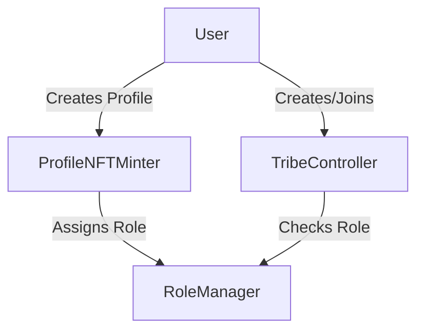
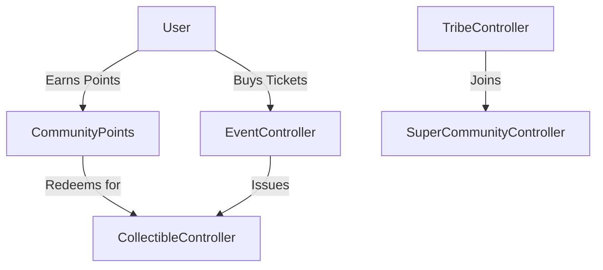
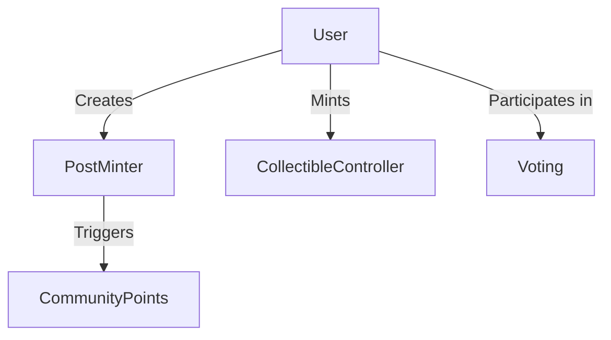

# Tribes by Astrix

A decentralized platform for community management and engagement, featuring points, events, and super communities.

## Project Structure

```
tribes-by-astrix/
  ├─ contracts/
  │   ├─ core/
  │   │   ├─ RoleManager.sol          # Role-based access control
  │   │   ├─ ProfileNFTMinter.sol     # Profile NFT management
  │   │   └─ TribeController.sol      # Tribe creation and management
  │   ├─ community/
  │   │   ├─ CommunityPoints.sol      # Points system & redemption
  │   │   ├─ EventController.sol      # Event & ticket management
  │   │   └─ SuperCommunityController.sol # Multi-tribe management
  │   ├─ content/
  │   │   ├─ PostMinter.sol          # Content posting
  │   │   ├─ CollectibleController.sol # NFT collectibles
  │   │   └─ Voting.sol              # Governance
  │   └─ interfaces/
  │       ├─ ITribeController.sol
  │       ├─ IEventController.sol
  │       └─ ICommunityPoints.sol
  ├─ test/
  │   ├─ unit/
  │   │   ├─ NFTController.test.ts
  │   │   ├─ TribeController.test.ts
  │   │   └─ ... other unit tests
  │   ├─ integration/
  │   │   └─ ... integration tests
  │   ├─ journey/
  │   │   └─ ... user journey tests
  │   ├─ helpers/
  │   │   └─ testSetup.ts           # Test environment setup
  │   └─ utils/
  │       └─ TestLogger.ts          # Test logging utility
  ├─ public/
  │   ├─ index.html                 # Test report template
  │   ├─ generate-report.js         # Report generation script
  │   ├─ run-tests.sh              # Test execution script
  │   └─ report/                    # Generated test reports
  │       ├─ test-results.json      # Latest test results
  │       ├─ test-results.csv       # CSV export
  │       └─ test-history.json      # Historical test data
  ├─ scripts/
  │   └─ deploy.ts
  ├─ hardhat.config.ts
  └─ package.json
```

## Core Components & Flow

### 1. Core Layer


- **RoleManager.sol**: Central authority for role-based access control
  - Roles: FAN, ORGANIZER, ARTIST, BRAND, MODERATOR
  - Hierarchical permissions system
  - Role inheritance and management

- **ProfileNFTMinter.sol**: User identity management
  - ERC721-based profile NFTs
  - Immutable username
  - Metadata management (avatar, bio)
  - Automatic FAN role assignment

- **TribeController.sol**: Base community management
  - Tribe creation and configuration
  - Whitelist-based membership
  - Admin controls
  - Parent-child tribe relationships

### 2. Community Layer


- **CommunityPoints.sol**: Points system (New)
  - Off-chain points tracking
  - On-chain redemption with signatures
  - Anti-replay protection
  - Points-to-collectibles conversion

- **EventController.sol**: Event management (New)
  - ERC1155-based ticketing
  - One-time transfer restriction
  - Attendance tracking
  - Event lifecycle

- **SuperCommunityController.sol**: Multi-tribe management (New)
  - Tribe grouping and hierarchy
  - Cross-tribe operations
  - Unified governance
  - Member aggregation

### 3. Content Layer


- **PostMinter.sol**: Content creation
  - Post creation and management
  - Tribe-specific content
  - Point earning triggers

- **CollectibleController.sol**: NFT management
  - ERC1155 collectibles
  - Event tickets
  - Limited editions
  - Redemption mechanics

- **Voting.sol**: Governance
  - Proposal creation
  - Voting mechanics
  - Role-based voting weight
  - Execution tracking

## Key Features

### 1. Points System
- Off-chain points earning
- Signature-based redemption
- Collectible rewards
- Activity tracking

### 2. Event Management
- Ticket minting
- Transfer restrictions
- Attendance tracking
- Event lifecycle

### 3. Super Communities
- Multi-tribe management
- Hierarchical structure
- Cross-tribe operations
- Unified governance

### 4. Security Features
- Role-Based Access Control (RBAC)
- Signature verification
- Transfer restrictions
- Rate limiting

## Test Execution and Reporting

### Running Tests
```bash
# Run all tests with report generation
npm test

# Run specific test suites
npm run test:unit
npm run test:integration
npm run test:journey

# Generate and view test report
npm run report
```

### Test Report Features
- **Interactive Web Interface**: View test results in a user-friendly web interface
- **Real-time Filtering**: Filter tests by:
  - Test name (search)
  - Test suite
  - Test status (passed/failed)
- **Visualizations**:
  - Pass/fail ratio charts
  - Historical trends
  - System resource usage
- **Detailed Test Information**:
  - Test output with colored log levels
  - Error details with stack traces
  - Test duration and timestamps
- **Historical Data**:
  - Track test runs over time
  - Monitor pass/fail trends
  - Track performance metrics

### Report Generation
The test reporting system generates three types of reports:
1. **HTML Report** (`http://localhost:3000`):
   - Interactive web interface
   - Real-time filtering and search
   - Data visualizations
2. **JSON Report** (`public/report/test-results.json`):
   - Structured test data
   - System information
   - Raw test output
3. **CSV Export** (`public/report/test-results.csv`):
   - Spreadsheet-compatible format
   - Test execution history
   - Summary statistics

## Development

### Setup
```bash
# Install dependencies
npm install

# Install dev dependencies
npm install --save-dev @openzeppelin/contracts @nomicfoundation/hardhat-toolbox

# Compile contracts
npx hardhat compile

# Run tests
npx hardhat test
```

### Deployment
```bash
# Set up environment variables in .env
PRIVATE_KEY=your_private_key_here

# Deploy to Monad Devnet
npx hardhat run scripts/deploy.ts --network monadDevnet
```

#### Network Details
- **Network Name**: Monad Devnet
- **Chain ID**: 20143
- **Currency Symbol**: DMON
- **RPC URL**: rpc-devnet.monadinfra.com/rpc/api-key
- **Gas Price**: 52 GWEI

#### Deployment Order
1. Deploy RoleManager
2. Deploy TribeController
3. Deploy SuperCommunityController (requires RoleManager and TribeController addresses)
4. Deploy EventController (requires RoleManager address)
5. Deploy CommunityPoints (requires RoleManager address)
6. Deploy remaining contracts with their dependencies

#### Post Deployment
After deployment, verify the contract addresses and update them in your frontend configuration.

### Testing
```bash
# Run specific test suite
npx hardhat test test/community/CommunityPoints.test.ts

# Run all tests
npx hardhat test

# Generate coverage
npx hardhat coverage
```

## Documentation
- [User Journeys](./docs/UserJourney.md)

## License
MIT
