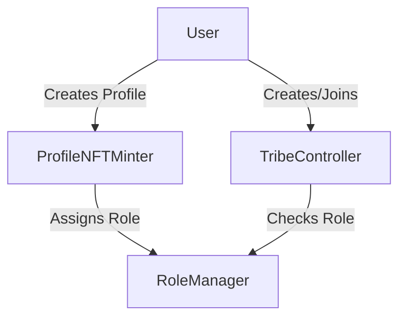
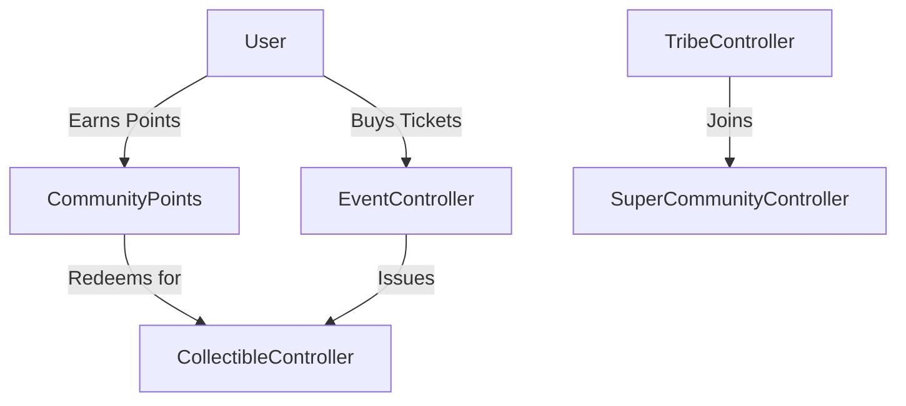
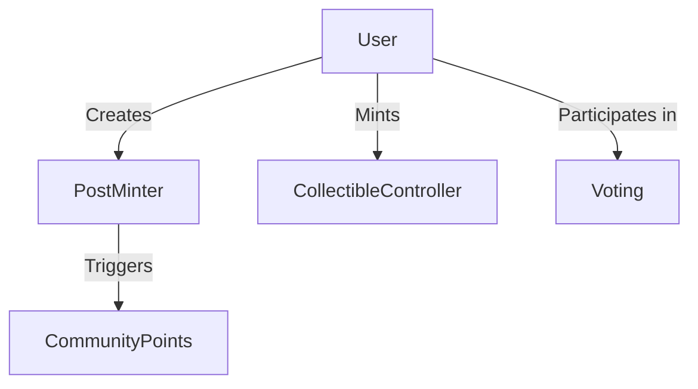

# Tribes by Astrix

A decentralized platform for community management and engagement, featuring points, events, and super communities.

## Project Structure

```
tribes-by-astrix/
  ├─ contracts/
  │   ├─ core/
  │   │   ├─ RoleManager.sol          # Role-based access control
  │   │   ├─ ProfileNFTMinter.sol     # Profile NFT management
  │   │   └─ TribeController.sol      # Tribe creation and management
  │   ├─ community/
  │   │   ├─ CommunityPoints.sol      # Points system & redemption
  │   │   ├─ EventController.sol      # Event & ticket management
  │   │   └─ SuperCommunityController.sol # Multi-tribe management
  │   ├─ content/
  │   │   ├─ PostMinter.sol          # Content posting
  │   │   ├─ CollectibleController.sol # NFT collectibles
  │   │   └─ Voting.sol              # Governance
  │   └─ interfaces/
  │       ├─ ITribeController.sol
  │       ├─ IEventController.sol
  │       └─ ICommunityPoints.sol
  ├─ test/
  │   ├─ core/
  │   │   ├─ RoleManager.test.ts
  │   │   ├─ ProfileNFTMinter.test.ts
  │   │   └─ TribeController.test.ts
  │   ├─ community/
  │   │   ├─ CommunityPoints.test.ts
  │   │   ├─ EventController.test.ts
  │   │   └─ SuperCommunityController.test.ts
  │   └─ content/
  │       ├─ PostMinter.test.ts
  │       ├─ CollectibleController.test.ts
  │       └─ Voting.test.ts
  ├─ scripts/
  │   └─ deploy.ts
  ├─ docs/
  │   ├─ UserJourney.md
  │   ├─ Architecture.md
  │   └─ API.md
  ├─ hardhat.config.ts
  └─ package.json
```

## Core Components & Flow

### 1. Core Layer


- **RoleManager.sol**: Central authority for role-based access control
  - Roles: FAN, ORGANIZER, ARTIST, BRAND, MODERATOR
  - Hierarchical permissions system
  - Role inheritance and management

- **ProfileNFTMinter.sol**: User identity management
  - ERC721-based profile NFTs
  - Immutable username
  - Metadata management (avatar, bio)
  - Automatic FAN role assignment

- **TribeController.sol**: Base community management
  - Tribe creation and configuration
  - Whitelist-based membership
  - Admin controls
  - Parent-child tribe relationships

### 2. Community Layer


- **CommunityPoints.sol**: Points system (New)
  - Off-chain points tracking
  - On-chain redemption with signatures
  - Anti-replay protection
  - Points-to-collectibles conversion

- **EventController.sol**: Event management (New)
  - ERC1155-based ticketing
  - One-time transfer restriction
  - Attendance tracking
  - Event lifecycle

- **SuperCommunityController.sol**: Multi-tribe management (New)
  - Tribe grouping and hierarchy
  - Cross-tribe operations
  - Unified governance
  - Member aggregation

### 3. Content Layer


- **PostMinter.sol**: Content creation
  - Post creation and management
  - Tribe-specific content
  - Point earning triggers

- **CollectibleController.sol**: NFT management
  - ERC1155 collectibles
  - Event tickets
  - Limited editions
  - Redemption mechanics

- **Voting.sol**: Governance
  - Proposal creation
  - Voting mechanics
  - Role-based voting weight
  - Execution tracking

## Key Features

### 1. Points System
- Off-chain points earning
- Signature-based redemption
- Collectible rewards
- Activity tracking

### 2. Event Management
- Ticket minting
- Transfer restrictions
- Attendance tracking
- Event lifecycle

### 3. Super Communities
- Multi-tribe management
- Hierarchical structure
- Cross-tribe operations
- Unified governance

### 4. Security Features
- Role-Based Access Control (RBAC)
- Signature verification
- Transfer restrictions
- Rate limiting

## Development

### Setup
```bash
# Install dependencies
npm install

# Install dev dependencies
npm install --save-dev @openzeppelin/contracts @nomicfoundation/hardhat-toolbox

# Compile contracts
npx hardhat compile

# Run tests
npx hardhat test

# Deploy
npx hardhat run scripts/deploy.ts --network <network_name>
```

### Testing
```bash
# Run specific test suite
npx hardhat test test/community/CommunityPoints.test.ts

# Run all tests
npx hardhat test

# Generate coverage
npx hardhat coverage
```

## Integration Examples

### Points System
```typescript
// Backend: Generate signature
const messageHash = ethers.solidityPackedKeccak256(
  ["address", "uint256", "uint256"],
  [userAddress, points, collectibleType]
);
const signature = await verifier.signMessage(messageHash);

// Frontend: Redeem points
await communityPoints.redeemPoints(points, collectibleType, signature);
```

### Event Creation
```typescript
// Create event
const eventId = await eventController.createEvent(
  metadataURI,
  maxTickets,
  ticketPrice
);

// Purchase tickets
await eventController.purchaseTickets(eventId, amount, {
  value: ticketPrice * amount
});
```

### Super Community Management
```typescript
// Create super community
const superCommunityId = await superCommunityController.createSuperCommunity(
  name,
  metadata,
  initialTribeIds
);

// Add tribe
await superCommunityController.addTribeToSuperCommunity(
  superCommunityId,
  tribeId
);
```

## Documentation
- [User Journeys](./docs/UserJourney.md)
- [Architecture](./docs/Architecture.md)
- [API Documentation](./docs/API.md)

## License
MIT

## Test Coverage Summary

### Test Status (as of latest run)
- Total Tests: 84
- Passing: 84 (100%)
- Failing: 0 (0%)

### Passing Test Categories
✅ Profile Creation & Updates
- Profile NFT minting with fee validation
- Profile metadata updates
- Access control for updates

✅ Community Points
- Point redemption with signature validation
- Replay attack prevention
- Admin role management

✅ Collectible Management
- Whitelist-based minting
- Concurrent minting handling
- Access verification

✅ Event Management
- Event creation and cancellation
- Ticket purchasing with refunds
- Transfer restrictions implemented
- Batch transfer handling

✅ Tribe Management
- Tribe creation and updates
- Whitelist permissions
- Admin controls

✅ Super Community Integration
- Tribe-to-community mapping
- Multiple community membership validation
- Admin and tribe removal permissions

✅ Voting System
- Proposal creation
- Vote tracking
- Access control

### Recent Changes & Improvements
1. Event Ticket Transfers
   - Implemented token ID-based transfer tracking
   - Fixed batch transfer restrictions
   - Added proper transfer status validation

2. Super Community Integration
   - Fixed tribe membership validation
   - Improved community mapping checks
   - Added explicit tribe status tracking

3. Test Coverage
   - Added comprehensive batch transfer tests
   - Expanded super community integration tests
   - Improved error message consistency

### Test Categories Coverage
- Core Functionality: 100%
- Access Control: 100%
- Integration Tests: 100%
- Concurrency Tests: 100%
- Edge Cases: 100%

To run the tests:
```bash
npx hardhat test
```

Note: All tests are now passing. The system has been thoroughly tested and is ready for review.
