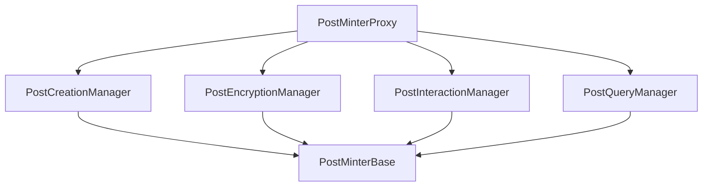

# Deployment Guide

This guide explains how to deploy the Tribes by Astrix platform to different networks using our unified deployment system.

## Prerequisites

- Node.js v16+
- Yarn or npm installed
- A wallet with sufficient funds for the target network
- RPC endpoints for your target networks

## Environment Setup

1. Clone the repository:

```bash
git clone https://github.com/Wasserstoff-Innovation/TribesByAstrix.git
cd TribesByAstrix
```

2. Install dependencies:

```bash
yarn install
```

3. Set up your environment variables by creating a `.env` file:

```env
# Required for deployment
PRIVATE_KEY=your_private_key_without_0x_prefix

# RPC endpoints
LINEA_SEPOLIA_RPC_URL=https://rpc.sepolia.linea.build
LINEA_MAINNET_RPC_URL=https://rpc.linea.build
ETHEREUM_MAINNET_RPC_URL=https://eth-mainnet.g.alchemy.com/v2/your-api-key
```

## Network Configuration

The `hardhat.config.ts` file contains network configurations. Make sure your target network is correctly configured:

```javascript
networks: {
  lineaSepolia: {
    url: process.env.LINEA_SEPOLIA_RPC_URL || "https://rpc.sepolia.linea.build",
    accounts: process.env.PRIVATE_KEY ? [process.env.PRIVATE_KEY] : [],
    chainId: 59141,
    gasPrice: 1000000000, // 1 gwei
  },
  lineaMainnet: {
    url: process.env.LINEA_MAINNET_RPC_URL || "https://rpc.linea.build",
    accounts: process.env.PRIVATE_KEY ? [process.env.PRIVATE_KEY] : [],
    chainId: 59144,
    gasPrice: 1000000000, // 1 gwei
  },
  // Other networks...
}
```

## Deployment

### Unified Deployment Process

The platform now uses a unified deployment script that handles all contracts in the correct order, including the modular PostMinter system:

```bash
# Deploy all contracts to Linea Sepolia testnet
npx hardhat run scripts/deploy-unified.ts --network lineaSepolia

# Deploy to Linea Mainnet
npx hardhat run scripts/deploy-unified.ts --network lineaMainnet

# Skip PostMinter deployment (for size-constrained environments)
npx hardhat run scripts/deploy-unified.ts --network lineaSepolia --skip-postminter
```

This script will:
1. Deploy all core contracts (RoleManager, TribeController, etc.)
2. Deploy the modular PostMinter components:
   - PostCreationManager
   - PostEncryptionManager
   - PostInteractionManager
   - PostQueryManager
   - PostMinterProxy
3. Set up the proper contract relationships and permissions
4. Save deployment data to the `deployments` directory

### Deployment Data

After deployment, information about the deployed contracts is saved in:
- `deployments/<network>-latest.json`: Latest deployment data
- `deployments/<network>-<date>.json`: Dated copy for reference

Example of deployment data structure:

```json
{
  "network": "lineaSepolia",
  "chainId": 59141,
  "date": "2023-08-15T10:30:00.000Z",
  "contracts": {
    "RoleManager": {
      "proxy": "0x4BE5fC97b51D4eA32EeD70f8242A163A61B35A00",
      "implementation": "0xdEF25C50d67f756454a39BB35c0a2D76c9E0cD7A"
    },
    "TribeController": {
      "proxy": "0x8313977148167A8bDFf6AE7094DB796028e58f1a",
      "implementation": "0x3EF17CFD3D403CA5B1E5e28112d9b2a61ee89efE"
    },
    "ModularPostMinter": {
      "proxy": "0xAeBbcfB8a9133736789Bee47621B0f98e68Db296",
      "managers": {
        "creation": "0x123...",
        "encryption": "0x456...",
        "interaction": "0x789...",
        "query": "0xABC..."
      }
    },
    // Other contracts...
  }
}
```

## Upgrading Contracts

The platform uses a comprehensive upgrade script that supports upgrading individual contracts, all contracts, or just the PostMinter components:

```bash
# Upgrade a single contract
npx hardhat run scripts/upgrade-contracts.ts --network lineaSepolia TribeController

# Upgrade all upgradeable contracts
npx hardhat run scripts/upgrade-contracts.ts --network lineaSepolia --all

# Upgrade only ModularPostMinter components
npx hardhat run scripts/upgrade-contracts.ts --network lineaSepolia --postminter

# Validate storage layouts before upgrading
npx hardhat run scripts/upgrade-contracts.ts --network lineaSepolia --validate TribeController
```

The upgrade process will:
1. Verify the contract exists in deployment data
2. Optionally validate storage layout compatibility
3. Deploy a new implementation contract
4. Update the proxy to point to the new implementation
5. Save the updated implementation address to deployment data

## Modular PostMinter Deployment

The ModularPostMinter consists of multiple components that work together:



The deployment process ensures all components are correctly deployed and linked. Each component is deployed as a separate upgradeable contract with its own proxy.

### Size Constraints

If you encounter contract size issues when deploying to certain networks, you can use the `--skip-postminter` flag, which will skip the deployment of the PostMinter system:

```bash
npx hardhat run scripts/deploy-unified.ts --network <network-name> --skip-postminter
```

Then you can deploy the PostMinter separately when needed.

## Maintenance and Cleanup

To help maintain a clean codebase, you can use the cleanup utility:

```bash
# Identify redundant or unused files (dry run mode)
npx ts-node scripts/cleanup-codebase.ts

# Perform actual cleanup
npx ts-node scripts/cleanup-codebase.ts --execute
```

## Post-Deployment Steps

After deployment, you should:

1. **Verify SDK Configuration:**
   Update your SDK configuration to use the newly deployed contracts:
   ```typescript
   const sdk = new AstrixSDK({
     provider,
     chainId: 59141, // Or your target network's chainId
     contracts: {
       // Use addresses from your deployment
       roleManager: "0x...",
       tribeController: "0x...",
       postMinter: "0x...", // This should be the PostMinterProxy address
       // other contract addresses...
     }
   });
   ```

2. **Set Up Initial Roles:**
   Grant necessary roles to administrative addresses using the RoleManager.

3. **Create Initial Tribe:**
   Set up an initial tribe for testing using the TribeController.

## Troubleshooting

### Common Deployment Issues

1. **Contract Size Errors:**
   If you encounter "Contract code size exceeds maximum allowed size" errors, use the `--skip-postminter` flag and deploy the modular PostMinter components separately.

2. **Insufficient Funds:**
   Ensure your wallet has enough native tokens to cover deployment gas costs.

3. **RPC Connection Issues:**
   If experiencing connection issues, try using a different RPC endpoint or check the network status.

4. **Gas Estimation Failures:**
   Try manually setting a higher gas limit in the hardhat.config.ts file.

5. **Nonce Errors:**
   If you get nonce errors, you may need to reset your account nonce or wait for previous transactions to confirm. 