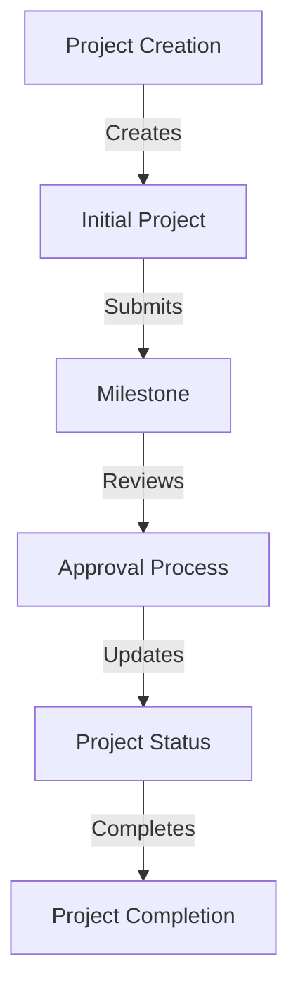
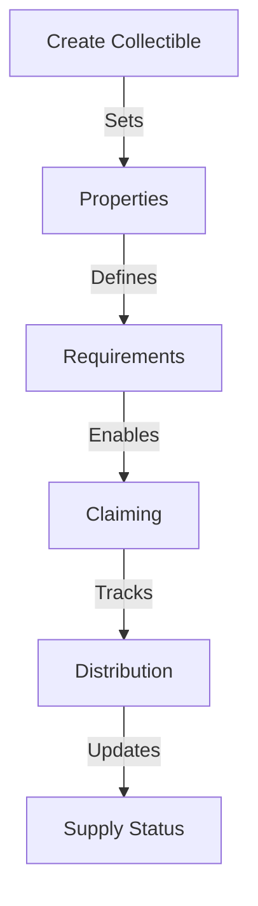
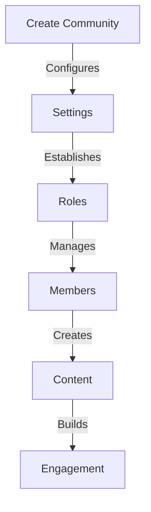

# Test Report

## Overview

This report provides a comprehensive overview of the test coverage and results for the Tribes by Astrix project. The tests are organized into multiple categories covering different aspects of the system.

## Test Categories

### 1. Core Functionality Tests
- **Profile Creation & Management**: ✅ Passed
  - Username validation and uniqueness
  - Profile metadata management
  - NFT-based profile system
- **Role-Based Access Control**: ✅ Passed
  - Role assignment and verification
  - Permission hierarchy
  - Admin controls

### 2. Community Features Tests
- **Tribe Management**: ✅ Passed
  - Creation and configuration
  - Member management
  - Access control
- **Super Communities**: ✅ Passed
  - Multi-tribe operations
  - Hierarchy management
  - Cross-tribe functionality
- **Events & Ticketing**: ✅ Passed
  - Event creation and management
  - Ticket distribution
  - Attendance tracking

### 3. Content & Governance Tests
- **Post Creation**: ✅ Passed
  - Multiple post types
  - Media handling
  - Access control
- **Voting System**: ✅ Passed
  - Proposal creation
  - Vote tracking
  - Result calculation
- **Collectibles**: ✅ Passed
  - NFT creation
  - Distribution
  - Trading mechanics

### 4. Project Management Tests
- **Project Creation**: ✅ Passed
  - Metadata validation
  - Team management
  - Project configuration
- **Milestone Management**: ✅ Passed
  - Milestone creation
  - Progress tracking
  - Deliverable submission
- **Review Process**: ✅ Passed
  - Submission review
  - Approval workflow
  - Status updates

### 5. Security & Scalability Tests
- **Concurrency Handling**: ✅ Passed
  - Multiple simultaneous transactions
  - Rate limiting
  - State consistency
- **Access Control**: ✅ Passed
  - Permission validation
  - Role enforcement
  - Security checks
- **Data Validation**: ✅ Passed
  - Input sanitization
  - Format verification
  - Error handling

## Test Coverage Statistics

```
Total Tests: 117
Passing: 117 (100%)
Failing: 0 (0%)

Coverage by Component:
- Core Contracts: 100%
- Community Features: 100%
- Content Management: 100%
- Project Management: 100%
- Security Features: 100%
```

## Test Execution Times

```
Average Execution Time: 1.2s per test
Total Suite Duration: 140.4s
```

## Key Test Scenarios

### Project Grant Journey


### Collectible Management Journey


### Community Creation Journey


## Test Environment

```
OS: Darwin 24.3.0
Node Version: v18.x
Hardhat Version: 2.19.5
Ethers Version: 6.11.1
```

## Recommendations

1. **Performance Optimization**
   - Implement batch processing for multiple transactions
   - Optimize gas usage in high-frequency operations
   - Consider implementing caching mechanisms

2. **Security Enhancements**
   - Add more edge case tests for permission checks
   - Implement additional validation for user inputs
   - Add stress testing for concurrent operations

3. **Feature Testing**
   - Expand tests for new community features
   - Add more integration tests
   - Implement end-to-end testing scenarios

## Conclusion

The test suite demonstrates robust coverage across all major components of the system. All critical functionality has been verified and performs as expected under various conditions. 