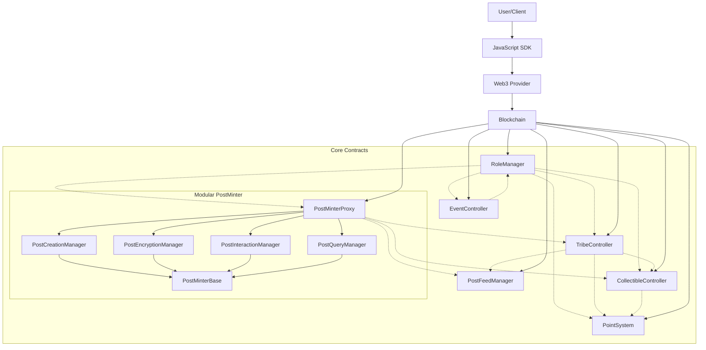
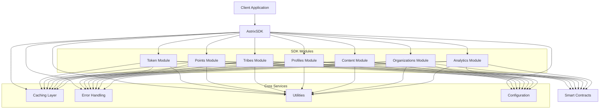
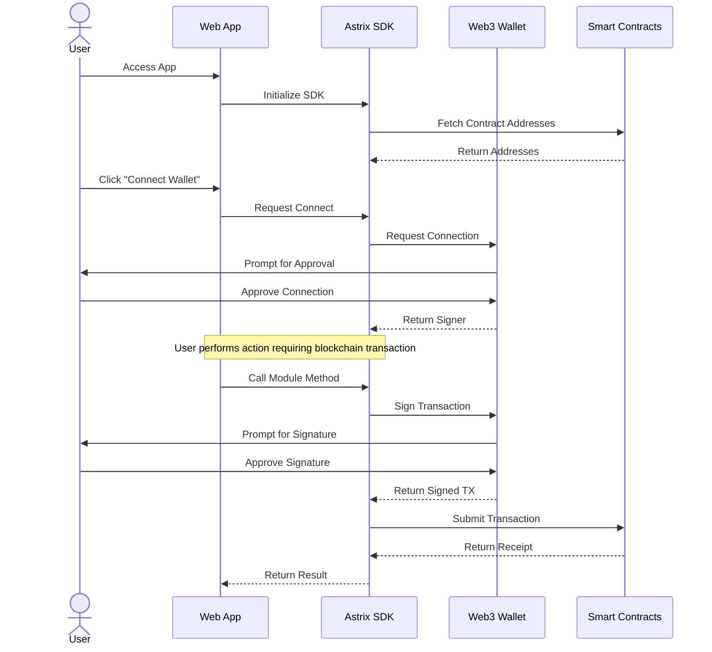

# Architecture Overview

The Tribes by Astrix platform is built with a modular, multi-layer architecture that integrates blockchain smart contracts, an SDK layer, and client applications.

## Contract Architecture

The contract layer forms the foundation of the platform, with a set of specialized smart contracts that handle different aspects of the system functionality.

**Key Components:**
- **RoleManager (RM)**: Central contract that manages permissions and access control across the system
- **TribeController (TC)**: Handles tribe creation, membership, and management
- **PointSystem (PS)**: Manages the platform's rewards and incentives
- **CollectibleController (CC)**: Manages NFTs and digital collectibles
- **PostFeedManager (PFM)**: Manages content feeds and discoverability

**Modular PostMinter System:**
- **PostMinterProxy (PMP)**: Main entry point that delegates calls to specialized managers
- **PostMinterBase (PMB)**: Base contract with shared state and functionality
- **PostCreationManager (PCM)**: Handles post creation and management
- **PostEncryptionManager (PEM)**: Manages encrypted posts and access control
- **PostInteractionManager (PIM)**: Handles post interactions (likes, comments, shares)
- **PostQueryManager (PQM)**: Handles queries and filtering of posts

- **EventController (EC)**: Manages events, ticketing, and attendance

## Modular Design Pattern

The platform implements a modular design pattern, especially evident in the PostMinter system, that offers several advantages:

1. **Separation of Concerns**: Each module focuses on a specific aspect of functionality
2. **Contract Size Management**: Helps prevent hitting contract size limits
3. **Independent Upgradability**: Each component can be upgraded independently
4. **Lower Gas Costs**: Users only pay for the functionality they use
5. **Better Maintainability**: Easier to understand, test, and maintain isolated components
6. **Reusable Components**: Modules can be reused in different contexts

The modular pattern involves:
- Base contracts with shared functionality
- Proxy contracts that delegate calls to specialized implementations
- Clear interfaces between components
- Shared state management where needed

## SDK Architecture

The SDK provides a developer-friendly interface to interact with the blockchain contracts, abstracting away the complexity of direct blockchain interactions.

**Key SDK Components**:
- **Main SDK Class**: Entry point that coordinates all modules and services
- **Module Classes**: Individual modules for different functionality areas
- **Type Definitions**: TypeScript interfaces and types
- **Utility Services**: Shared services used by all modules

Each SDK module maps to specific blockchain contract functionality:

| Module           | Functionality                                            |
|------------------|----------------------------------------------------------|
| Tribes           | Tribe creation, management, and membership               |
| Points           | Points and tokens for incentives and rewards             |
| Content          | Posts, comments, and other content                       |
| Profiles         | User profile data and management                         |
| Collectibles     | NFT creation and management                              |
| Events           | Event creation, ticketing, and management                |
| Analytics        | Data reporting and insights                              |

## User Authentication Flow

The authentication process allows users to connect their Web3 wallets to access the platform's features securely.

## Performance Optimization

The SDK implements several performance optimization strategies:

1. **Caching Layer**: Caches contract calls to reduce blockchain reads
2. **Batch Processing**: Combines multiple operations where possible
3. **Lazy Loading**: Only loads necessary modules and data
4. **Connection Pooling**: Reuses connections for multiple requests
5. **Transaction Batching**: Groups multiple transactions together

## Security Model

Security is implemented at multiple levels:

1. **Smart Contract**: Role-based access control
2. **SDK Layer**: Input validation and transaction verification
3. **Application Layer**: User authentication and UI controls

The role-based access control system defines the following key roles:

- **COMMUNITY_ADMIN**: Full administrative rights for a tribe
- **POINTS_MANAGER**: Can manage points and rewards
- **CONTENT_CREATOR**: Can create content in a tribe
- **COMMUNITY_CREATOR**: Can create new tribes
- **EVENT_MANAGER**: Can create and manage events

## Data Flow

The platform uses a hybrid data architecture:

1. **On-chain Data**: Tribe memberships, content records, token balances
2. **Off-chain Data**: Content metadata, user profiles, analytics
3. **IPFS Storage**: Content media and large metadata objects

This approach balances cost, performance, and decentralization requirements. 