# Test Report: Journey Tests

This document provides an overview and status report for the end-to-end journey tests that validate complete user flows in the Tribes by Astrix platform.

## Overview

Journey tests simulate real user interactions, testing multiple contracts and components together to ensure features work correctly from the user's perspective. They are crucial for validating the integrated system.

## Latest Test Run Status

**Status:** ✅ **All Passing** (211 / 211 tests passed)
**Date:** [24-April-2025]

*Note: A detailed JSON and CSV report is available in `/public/report/` after running the tests.*

## Test Suite Summary

The journey tests cover the following key user flows and system aspects:

| Test File                          | Description                                                                  | Status |
| :-----------------------------------| :---------------------------------------------------------------------------| :----- |
| `Analytics.test.ts`                 | Tests related to fetching and validating analytics data.                    | ✅     |
| `CollectibleController.test.ts`     | Unit tests for the Collectible Controller functionality.                    | ✅     |
| `CommunityCreatorJourney.test.ts`   | Focuses on the flow of a user creating and configuring a new community.     | ✅     |
| `EventController.test.ts`           | Unit tests for the Event Controller functionality.                          | ✅     |
| `EventJourney.test.ts`              | End-to-end flows for event creation, ticket purchasing, and management.     | ✅     |
| `FundraiserJourneyV2.test.ts`       | End-to-end flows for fundraiser creation, contribution, and validation.     | ✅     |
| `Points.test.ts`                    | Unit tests for the Points System functionality.                             | ✅     |
| `PostJourneyV2.test.ts`             | End-to-end flows for post creation (various types), interactions, gating.   | ✅     |
| `PostListingTest.test.ts`           | Tests focused on retrieving and paginating post listings.                   | ✅     |
| `PostMinter.test.ts`                | Unit tests for the Post Minter and its sub-managers.                        | ✅     |
| `ProfileAndTribeComprehensive.test.ts`| Comprehensive tests covering profile and tribe interactions.              | ✅     |
| `ProfileNFTMinter.test.ts`          | Unit tests for the Profile NFT Minter functionality.                        | ✅     |
| `ProjectController.test.ts`         | Journey tests focusing on project validation and milestone management.      | ✅     |
| `ProjectGrantJourneyV2.test.ts`     | End-to-end flows for project creation, updates, and permissions.            | ✅     |
| `RoleManager.test.ts`               | Unit tests for the Role Manager functionality.                              | ✅     |
| `TribeController.test.ts`           | Unit tests for the Tribe Controller functionality.                          | ✅     |
| `TribeListing.test.ts`              | Tests focused on retrieving and paginating tribe listings.                  | ✅     |
| `TribeMembership.test.ts`           | Tests focused on various tribe joining and membership scenarios.            | ✅     |
| `TribeMetadata.test.ts`             | Tests related to tribe metadata storage and retrieval.                      | ✅     |
| `UserProfileAndTribeJourney.test.ts`| Complete end-to-end user journey simulation.                                | ✅     |
| `Voting.test.ts`                    | Unit tests for the Voting contract functionality.                           | ✅     |

## Key Flows Tested

The journey tests cover a wide range of user interactions and system checks:

```mermaid
graph TD
    %% Main setup and entry points
    Setup[Setup & Deployment] --> Roles[Role Management]
    Roles --> UserActions[User Actions]
    Roles --> AdminActions[Admin/Creator Actions]

    %% User Actions Section - More vertical layout
    UserActions --> Profile[Profile Management]
    UserActions --> Community[Community Participation]
    UserActions --> ContentInter[Content Interaction]
    UserActions --> Purchase[Purchases & Claims]

    %% Profile Management details
    Profile --> CreateProfile[Create Profile]
    Profile --> UpdateProfile[Update Profile]

    %% Community Participation details
    Community --> JoinTribe[Join Tribe]
    Community --> RequestJoin[Request to Join Private Tribe]
    Community --> JoinWithCode[Join with Invite Code]

    %% Content Interaction details
    ContentInter --> LikeComment[Like/Comment]
    ContentInter --> ReportPost[Report Post]
    ContentInter --> ViewGated[View Gated Content]
    ContentInter --> ProjectAction[Project Actions]

    %% Project Actions sub-details
    ProjectAction --> StartMilestone[Start Milestone]
    ProjectAction --> SubmitDeliverable[Submit Deliverable]

    %% Purchases & Claims details
    Purchase --> BuyCollectible[Purchase Collectible]
    Purchase --> BuyTicket[Purchase Event Ticket]
    Purchase --> TransferTicket[Transfer Ticket]
    Purchase --> Contribute[Fundraiser Contribution]

    %% Admin Actions Section - More vertical layout
    AdminActions --> TribeManage[Tribe Management]
    AdminActions --> ContentCreation[Content Creation]
    AdminActions --> AssetManage[Asset Management]
    AdminActions --> ProjectManage[Project Management]

    %% Tribe Management details
    TribeManage --> CreateTribe[Create Tribe]
    TribeManage --> UpdateTribe[Update Tribe Config]
    TribeManage --> ManageMembers[Manage Members]
    TribeManage --> CreateInvite[Create Invite Code]

    %% Content Creation details
    ContentCreation --> BasicPost[Basic Posts]
    ContentCreation --> GatedPost[Gated Posts]
    ContentCreation --> SpecialPost[Specialized Posts]

    %% Basic Posts types
    BasicPost --> PublicPost[Public Post]
    BasicPost --> EncryptedPost[Encrypted Post]

    %% Specialized Posts types
    SpecialPost --> CommunityUpdate[Community Update]
    SpecialPost --> EventPost[Event Post]
    SpecialPost --> ProjectPost[Project Post]
    SpecialPost --> PollPost[Poll Post]
    SpecialPost --> ResourcePost[Resource Post]
    SpecialPost --> MediaPost[Rich Media Post]
    SpecialPost --> MilestonePost[Milestone Post]
    SpecialPost --> FundraiserPost[Fundraiser Post]

    %% Asset Management details
    AssetManage --> CreateCollectible[Create Collectible]
    AssetManage --> DeactivateCollectible[Deactivate Collectible]
    AssetManage --> CreateEvent[Create Event]
    AssetManage --> ManageEvent[Update/Cancel Event]
    AssetManage --> AwardPoints[Award Points]

    %% Project Management details
    ProjectManage --> CreateProject[Create Project]
    ProjectManage --> AddTeamMember[Add Team Member]
    ProjectManage --> ReviewMilestone[Review Milestone]

    %% System Checks - Grouped at bottom
    SystemChecks[System Checks] --> Validation[Metadata Validation]
    SystemChecks --> Access[Access Control]
    SystemChecks --> RateLimit[Rate Limiting]
    SystemChecks --> SupplyLimit[Supply Limits]
    SystemChecks --> Gating[NFT/Points Gating]
    SystemChecks --> Concurrency[Concurrency]

    %% Connect System Checks to affected actions
    Validation -.-> ContentCreation
    Access -.-> UserActions
    Access -.-> AdminActions
    RateLimit -.-> ContentCreation
    RateLimit -.-> ContentInter
    SupplyLimit -.-> BuyCollectible
    SupplyLimit -.-> BuyTicket
    Gating -.-> JoinTribe
    Gating -.-> BuyCollectible
    Gating -.-> ViewGated
    Concurrency -.-> BuyCollectible
```



**Detailed Flow Coverage:**

1.  **Setup & Roles:** Deployment of all core contracts and assignment of granular roles.
2.  **User Profiles:** Creation, validation, metadata updates, ownership.
3.  **Tribe Lifecycle:** Creation (Public, Private, Invite, NFT-Gated), configuration updates, membership management (joining, banning), access control.
4.  **Collectibles:** Creation (Standard, points-required, limited), management (deactivation), claiming (ETH, free, points), supply/points/status enforcement.
5.  **Posts:** Creation (various types including gated/encrypted), interaction (likes, comments), management (deletion), access control.
6.  **Feeds:** Retrieval by tribe/user, pagination, ordering.
7.  **Events:** Creation (physical, virtual, hybrid), ticketing (purchase, supply, transfer), management (updates, cancellation).
8.  **Projects & Grants:** Creation via `PostMinter`, validation via `ProjectController`, updates, team/milestone management, permission checks.
9.  **Fundraisers:** Creation, contribution simulation, access control.
10. **Points System:** Awarding points, using points for collectible gating.
11. **Concurrency & Scalability:** Simulated concurrent collectible claims.
12. **Error Handling:** Testing invalid inputs, permissions, rate limits, requirements, duplicates, deleted content interactions.

## Running Tests

To run all journey tests and update the report files:

```bash
npm run test:journey
```

To run a specific journey test file:

```bash
npx hardhat test test/journey/<test-file-name>.test.ts
```

*(This content is based on the `test/journey/README.md` file and the latest test results.)* 