# Tribes by Astrix Documentation

This document provides a comprehensive overview of the Tribes by Astrix system architecture and key user flows, showing how components interact and users navigate through the system.

## System Architecture

The Tribes by Astrix platform relies on a sophisticated multi-layer architecture that integrates blockchain smart contracts, an SDK layer, and client applications.

### Contract Architecture

The contract layer forms the foundation of the platform, with a set of specialized smart contracts that handle different aspects of the system functionality.


**Key Components:**
- **RoleManager (RM)**: Central contract that manages permissions and access control across the system
- **TribeController (TC)**: Handles tribe creation, membership, and management
- **PointSystem (PS)**: Manages the platform's rewards and incentives
- **CollectibleController (CC)**: Manages NFTs and digital collectibles
- **PostFeedManager (PFM)**: Manages content feeds and discoverability
- **PostMinter (PM)**: Handles the creation of content as on-chain assets
- **EventController (EC)**: Manages events, ticketing, and attendance

The RoleManager is the central authority that connects to all other contracts, while each specialized contract interacts with others as needed to fulfill its responsibilities.

### SDK Architecture

The SDK provides a developer-friendly interface to interact with the blockchain contracts, abstracting away the complexity of direct blockchain interactions.


**Key Components:**
- **SDK Modules**: Specialized modules for different functionality areas (Token, Points, Tribes, Profiles, Content, Organizations, Analytics)
- **Core Services**: Shared utilities used by all modules (Caching, Error Handling, Utilities, Configuration)

Each module interfaces directly with blockchain contracts while utilizing shared core services for efficiency and consistency.

### User Authentication Flow

The authentication process allows users to connect their Web3 wallets to access the platform's features securely.

```mermaid
sequenceDiagram
    actor User
    participant App as Web App
    participant SDK as Astrix SDK
    participant Wallet as Web3 Wallet
    participant Contracts as Smart Contracts
    
    User->>App: Access App
    App->>SDK: Initialize SDK
    SDK->>Contracts: Fetch Contract Addresses
    Contracts-->>SDK: Return Addresses
    
    User->>App: Click "Connect Wallet"
    App->>SDK: Request Connect
    SDK->>Wallet: Request Connection
    Wallet->>User: Prompt for Approval
    User->>Wallet: Approve Connection
    Wallet-->>SDK: Return Signer
    
    Note over App,SDK: User performs action requiring blockchain transaction
    
    App->>SDK: Call Module Method
    SDK->>Wallet: Sign Transaction
    Wallet->>User: Prompt for Signature
    User->>Wallet: Approve Signature
    Wallet-->>SDK: Return Signed TX
    SDK->>Contracts: Submit Transaction
    Contracts-->>SDK: Return Receipt
    SDK-->>App: Return Result
```



**Process Summary:**
1. User connects wallet to app and SDK receives signer
2. For blockchain transactions, user signs with wallet
3. Signed transactions are submitted to contracts
4. Results return to app for display to user

This flow ensures secure, user-approved interactions with the blockchain while maintaining a seamless user experience.

### Cache Invalidation Flow

To maintain performance while ensuring data accuracy, the SDK implements a caching system with smart invalidation rules.


**Process Summary:**
1. Read operations check cache first before fetching from blockchain
2. Write operations that change state invalidate related cache entries
3. Cache invalidation uses both pattern-based and key-specific approaches
4. This strategy improves performance while maintaining data consistency

### Tribe Creation and Management Flow

Tribes are the fundamental community units with flexible access models and governance.


**Process Summary:**
1. Admin creates tribe with metadata and access model (public, token-gated, invite-only)
2. Users join based on access requirements
3. Joined users can participate in tribe activities (content, events, fundraisers)

### Event and Fundraiser Integration

Events and fundraisers are key activities that generate engagement and resources.


**Process Summary:**
1. Tribes host events and fundraisers to generate resources
2. Revenue flows into tribe treasury
3. Resources fund tribe activities and growth
4. Creates a sustainable ecosystem

## Event User Flows

This section outlines the key user journeys in the event management system with visual diagrams and descriptions.

### Event Setup

**Description**: 
Initial setup of contracts and roles required for event management.


**User Journey**:
1. Admin deploys all required contracts and establishes their relationships
2. Admin assigns specialized roles (admin, moderator, event organizer)
3. Admin creates a new tribe as a container for event activities
4. Regular users join the tribe to participate in events

### Physical Event Creation

**Description**:
Creation of a physical event by an authorized organizer.


**User Journey**:
1. Event organizer designs a physical meetup with complete details
2. Organizer sets dates, location, coordinates, and capacity
3. Organizer establishes ticket types with pricing and limits
4. Organizer submits the event with metadata, maximum tickets, and base price
5. System validates and stores the event data
6. System emits an EventCreated event to notify tribe members
7. System assigns an event ID for future reference

### Event Validation

**Description**:
System handling of various metadata formats and validation rules.


**User Journey**:
1. Organizer creates events with different metadata configurations
2. System accepts valid JSON metadata regardless of content
3. System handles empty metadata strings
4. System accepts various ticket and price configurations
5. System consistently enforces organizer role requirement

### Hybrid Event Setup

**Description**:
Configuration of events with both physical and virtual components.


**User Journey**:
1. Organizer creates a hybrid event with both physical and virtual components
2. Organizer defines both physical venue and virtual URL
3. Organizer sets different capacities for physical and virtual attendance
4. Organizer creates different ticket types with appropriate pricing
5. Physical tickets are priced higher due to venue costs and limited capacity
6. System processes the event creation and assigns an ID

### Ticket Purchase

**Description**:
Basic ticket purchasing flow for event attendance.


**User Journey**:
1. Regular user views the event details
2. User decides to purchase 2 tickets
3. User sends the exact payment amount for the tickets
4. System validates the payment amount
5. System processes the purchase and assigns tickets
6. System emits a TicketPurchased event
7. System updates the user's ticket balance
8. User can verify their ticket ownership

### Payment Processing

**Description**:
Handling of overpayments with automatic refund capability.


**User Journey**:
1. User decides to purchase 1 ticket at 0.1 ETH
2. User accidentally sends 0.2 ETH (double the required amount)
3. System recognizes the overpayment
4. System processes the ticket purchase at the correct price
5. System automatically refunds the excess 0.1 ETH to the user
6. User receives both the ticket and the refund

### Supply Management

**Description**:
Enforcement of ticket limits to prevent overselling.


**User Journey**:
1. Event has a maximum capacity of 300 tickets
2. User attempts to purchase 301 tickets (exceeding capacity)
3. System validates against the maximum supply
4. System rejects the purchase with a "Not enough tickets" error
5. No tickets are issued and payment is not processed

### Payment Validation

**Description**:
Verification of sufficient payment for ticket purchases.


**User Journey**:
1. User attempts to purchase 2 tickets (requiring 0.2 ETH)
2. User only sends 0.1 ETH (half the required amount)
3. System validates the payment against ticket price
4. System rejects the transaction with "Insufficient payment" error
5. No tickets are issued and payment is returned

### Ticket Transfer

**Description**:
Transfer of tickets between users with anti-scalping measures.


**User Journey**:
1. User 1 purchases a ticket to an event
2. User 1 decides to transfer the ticket to User 2
3. User 1 initiates a ticket transfer using the NFT transfer functionality
4. System processes the transfer and updates ownership records
5. System flags the ticket as having been transferred once
6. User 2 receives the ticket and can verify ownership
7. User 2 attempts to transfer the ticket again
8. System blocks the second transfer with "Ticket already transferred once" error

### Event Updates

**Description**:
Updating event details after initial creation.


**User Journey**:
1. Organizer creates an event with initial details
2. Organizer later needs to update event information
3. Organizer submits updated metadata with new title, description, and venue
4. System validates the organizer's authority
5. System updates the stored metadata
6. Changes are immediately visible to potential attendees

### Event Cancellation

**Description**:
Cancellation process and prevention of new ticket sales.


**User Journey**:
1. Organizer decides to cancel a scheduled event
2. Organizer calls the cancel function for the specific event
3. System validates the organizer's authority
4. System updates the event status to inactive
5. Event remains in the system but is marked as canceled
6. Users attempting to purchase tickets are blocked
7. System rejects new purchases with "Event not active" error 

## Fundraiser User Flows

This section outlines the key user journeys in the fundraiser system with visual diagrams and descriptions.

### Fundraiser Setup

**Description**: 
Initial setup of contracts and roles required for fundraiser management.


**User Journey**:
1. Admin deploys all required contracts and establishes their relationships
2. Admin assigns specialized roles (admin, moderator, fundraiser creator)
3. Admin creates a new tribe as a container for fundraising activities
4. Various users join the tribe (fundraiser creator, contributors)
5. Admin bans a problematic member to test access controls

### Standard Fundraiser

**Description**:
Creation of a basic fundraiser by an authorized creator.


**User Journey**:
1. Fundraiser creator designs a community garden project with complete details
2. Creator sets a funding target of 1000 ETH with a 30-day duration
3. Creator establishes three contribution tiers (Bronze: 50 ETH, Silver: 100 ETH, Gold: 200 ETH)
4. Creator adds supplementary metadata (images, documents, website)
5. Creator submits the fundraiser to the tribe
6. System validates and stores the fundraiser data
7. System emits a PostCreated event to notify tribe members

### Multi-Currency Fundraiser

**Description**:
Configuration of fundraisers with different currency options.


**User Journey**:
1. Creator designs three separate fundraisers with identical parameters
2. Each fundraiser specifies a different currency (ETH, USDC, TRIBE_TOKEN)
3. Creator submits each fundraiser with appropriate cooldown periods between submissions
4. System validates and stores each fundraiser with its specific currency
5. System emits a PostCreated event for each submission

### Time-Flexible Fundraiser

**Description**:
Fundraisers with varying durations from one week to three months.

```mermaid
flowchart TD
    A[Creator] --> B[Design Fundraisers]
    B --> C1[One-Week Campaign]
    B --> C2[One-Month Campaign]
    B --> C3[Three-Month Campaign]
    
    C1 --> D1[Submit with Cooldown]
    C2 --> D2[Submit with Cooldown]
    C3 --> D3[Submit with Cooldown]
    
    D1 --> E1[Store 7-Day Fundraiser]
    D2 --> E2[Store 30-Day Fundraiser]
    D3 --> E3[Store 90-Day Fundraiser]
    
    E1 --> F1[Emit PostCreated Event]
    E2 --> F2[Emit PostCreated Event]
    E3 --> F3[Emit PostCreated Event]
```

**User Journey**:
1. Creator designs three fundraisers with identical parameters except duration
2. Creator sets different timeframes: 7 days (1 week), 30 days (1 month), and 90 days (3 months)
3. Creator submits each fundraiser with appropriate cooldown periods
4. System validates and stores each fundraiser with its specific duration
5. System emits a PostCreated event for each submission

### Contribution Tracking

**Description**:
System tracking of user interactions with fundraisers.

```mermaid
flowchart TD
    A[Fundraiser Creator] --> B[Create Test Fundraiser]
    B --> C[System Assigns ID]
    C --> D[Contributor Interacts]
    D --> E[System Records Interaction]
    E --> F[Verify Interaction Count]
```

**User Journey**:
1. Fundraiser creator establishes a test fundraiser with multiple tiers
2. System creates the fundraiser and assigns it an ID
3. Contributor 1 interacts with the fundraiser post (simulating a contribution)
4. System records the interaction/contribution
5. System verifies the interaction count is updated correctly

### Access Control

**Description**:
Prevention of banned members from interacting with fundraisers.

```mermaid
flowchart TD
    A[Create Fundraiser] --> B[Banned Member Attempts Interaction]
    B --> C{Check Member Status}
    C -->|Banned| D[Reject with InsufficientAccess]
    C -->|Active| E[Allow Interaction]
    D --> F[Interaction Count Unchanged]
    E --> G[Increment Interaction Count]
```

**User Journey**:
1. Fundraiser creator establishes a test fundraiser
2. A banned member attempts to interact with the fundraiser
3. System identifies the banned status of the user
4. System rejects the interaction attempt with "InsufficientAccess" error
5. Fundraiser interaction counts remain unchanged

### Deleted Fundraiser Protection

**Description**:
Prevention of interactions with removed fundraisers.

```mermaid
flowchart TD
    A[Create Fundraiser] --> B[Creator Deletes Fundraiser]
    B --> C[Mark as Deleted]
    C --> D[Contributor Attempts Interaction]
    D --> E{Check Fundraiser Status}
    E -->|Deleted| F[Reject with PostDeleted]
    E -->|Active| G[Allow Interaction]
    F --> H[No Interactions Recorded]
```

**User Journey**:
1. Fundraiser creator establishes a test fundraiser
2. Creator later decides to delete the fundraiser
3. System marks the fundraiser as deleted
4. Contributor attempts to interact with the deleted fundraiser
5. System rejects the interaction with "PostDeleted" error
6. No interactions are recorded for the deleted fundraiser

### Frontend Validation

**Description**:
Recommended validation rules for the frontend interface.

```mermaid
flowchart TD
    A[Frontend Validations] --> B[Date Validations]
    A --> C[Amount Validations]
    A --> D[Tier Validations]
    A --> E[Currency Validations]
    
    subgraph DateRules [Date Rules]
        B1[Start Date in Future]
        B2[Duration Between 1 Week - 3 Months]
    end
    
    subgraph AmountRules [Amount Rules]
        C1[Target > 0]
        C2[Target Under Max Limit]
    end
    
    subgraph TierRules [Tier Rules]
        D1[At Least One Tier]
        D2[Amounts in Ascending Order]
        D3[No Duplicate Names]
        D4[All Amounts > 0]
    end
    
    subgraph CurrencyRules [Currency Rules]
        E1[From Supported List]
        E2[Valid Contract if Token]
    end
    
    B --> B1
    B --> B2
    
    C --> C1
    C --> C2
    
    D --> D1
    D --> D2
    D --> D3
    D --> D4
    
    E --> E1
    E --> E2
```

**Validation Categories**:
1. **Date Validations**:
   - Start date must be in the future
   - Duration must be between 1 week and 3 months

2. **Amount Validations**:
   - Target amount must be > 0
   - Target amount must be reasonable (platform-specific max)

3. **Tier Validations**:
   - At least one tier required
   - Tier amounts must be in ascending order
   - No duplicate tier names
   - Tier amounts must be > 0

4. **Currency Validations**:
   - Currency must be from supported list
   - If token, must be valid contract address

These frontend validations complement the contract-level validations to create a seamless and error-resistant user experience.

## Conclusion

This documentation provides a comprehensive overview of the Tribes by Astrix platform architecture and user flows. The key aspects of the system include:

1. **Modular Architecture** with specialized contracts and SDK modules
2. **Role-Based Access** for system security and integrity
3. **Flexible Community Model** supporting diverse tribe formations
4. **Event Management** with physical, virtual, and hybrid options
5. **Fundraising Capabilities** supporting multiple currencies and durations
6. **Robust Validation** at both contract and frontend levels

This documentation serves as both a reference for understanding the system and a guide for implementation and testing. 