# Tribes by Astrix: User Flows & System Architecture

<div align="center">
  
  <p><em>Building decentralized communities with ownership and rewards</em></p>
</div>

## Introduction

Tribes by Astrix is a comprehensive platform that enables the creation and management of decentralized communities (tribes) with integrated tokenomics, content management, and governance. This document provides detailed explanations of the system architecture and key user flows.

<table>
<tr>
<td width="50%" valign="top">

### Core Features

- **Community Creation** - Launch customizable tribes with flexible access models
- **Tokenomics** - Create community-specific tokens and points systems
- **Content Management** - Share and monetize content within communities
- **Digital Collectibles** - Create and distribute NFTs with utility
- **Events** - Host physical, virtual, and hybrid community events
- **Fundraising** - Run community fundraisers with transparent tracking

</td>
<td width="50%" valign="top">

### Technology Stack

- **Smart Contracts** - Solidity on Monad blockchain
- **Backend** - TypeScript SDK with caching and state management
- **Frontend** - Next.js with Tailwind CSS
- **Identity** - NFT-based profiles with reputation
- **Storage** - Decentralized content storage with IPFS
- **Authentication** - Web3 wallet-based authentication

</td>
</tr>
</table>

---

## System Architecture

The Tribes by Astrix platform relies on a sophisticated multi-layer architecture that integrates blockchain smart contracts, an SDK layer, and client applications.

### Contract Architecture

The contract layer forms the foundation of the platform, with a set of specialized smart contracts that handle different aspects of the system functionality.

```mermaid
flowchart TD
    User[User/Client] --> SDK[JavaScript SDK]
    SDK --> Provider[Web3 Provider]
    Provider --> Blockchain[Monad Blockchain]
    
    subgraph Core Contracts
        RM[RoleManager] --- TC[TribeController]
        RM --- PS[PointSystem]
        RM --- CC[CollectibleController]
        RM --- PFM[PostFeedManager]
        RM --- PM[PostMinter]
        RM --- EC[EventController]
        
        TC --- PS
        TC --- CC
        TC --- PFM
        
        CC --- PS
        
        PM --- TC
        PM --- CC
        PM --- PFM
        
        EC --- RM
    end
    
    Blockchain --> Core Contracts
    
    classDef primary fill:#4f46e5,stroke:#c7d2fe,stroke-width:2px,color:#ffffff;
    classDef secondary fill:#1e293b,stroke:#94a3b8,stroke-width:1px,color:#ffffff;
    
    class User,SDK,Provider secondary;
    class RM,TC,PS,CC,PFM,PM,EC primary;
    class Blockchain secondary;
```

#### Key Contract Components

<div class="grid-container" style="display: grid; grid-template-columns: repeat(2, 1fr); gap: 16px;">
  <div class="grid-item" style="border: 1px solid #334155; border-radius: 8px; padding: 16px; background-color: #1e293b;">
    <h4>RoleManager (RM)</h4>
    <p>Central contract that manages permissions and access control across the system</p>
  </div>
  <div class="grid-item" style="border: 1px solid #334155; border-radius: 8px; padding: 16px; background-color: #1e293b;">
    <h4>TribeController (TC)</h4>
    <p>Handles tribe creation, membership, and management</p>
  </div>
  <div class="grid-item" style="border: 1px solid #334155; border-radius: 8px; padding: 16px; background-color: #1e293b;">
    <h4>PointSystem (PS)</h4>
    <p>Manages the platform's rewards and incentives</p>
  </div>
  <div class="grid-item" style="border: 1px solid #334155; border-radius: 8px; padding: 16px; background-color: #1e293b;">
    <h4>CollectibleController (CC)</h4>
    <p>Manages NFTs and digital collectibles</p>
  </div>
  <div class="grid-item" style="border: 1px solid #334155; border-radius: 8px; padding: 16px; background-color: #1e293b;">
    <h4>PostFeedManager (PFM)</h4>
    <p>Manages content feeds and discoverability</p>
  </div>
  <div class="grid-item" style="border: 1px solid #334155; border-radius: 8px; padding: 16px; background-color: #1e293b;">
    <h4>PostMinter (PM)</h4>
    <p>Handles the creation of content as on-chain assets</p>
  </div>
  <div class="grid-item" style="border: 1px solid #334155; border-radius: 8px; padding: 16px; background-color: #1e293b;">
    <h4>EventController (EC)</h4>
    <p>Manages events, ticketing, and attendance</p>
  </div>
</div>

The RoleManager is the central authority that connects to all other contracts, while each specialized contract interacts with others as needed to fulfill its responsibilities.

### SDK Architecture

The SDK provides a developer-friendly interface to interact with the blockchain contracts, abstracting away the complexity of direct blockchain interactions.


<table>
<tr>
<td width="50%" valign="top">

#### SDK Modules

Each module provides domain-specific functionality:

- **Token Module**: Manage community tokens
- **Points Module**: Handle points/rewards systems
- **Tribes Module**: Create and manage tribes
- **Profiles Module**: User profiles and reputation
- **Content Module**: Post creation and discovery
- **Analytics Module**: Community insights and metrics
- **Organizations Module**: Multi-tribe organizations

</td>
<td width="50%" valign="top">

#### Core Services

Shared utilities used by all modules:

- **Caching Layer**: Local state management and optimizations
- **Error Handling**: Standardized error processing
- **Utilities**: Helper functions and conversions
- **Configuration**: Network and contract settings
- **Signature Verification**: Wallet and message validation
- **Formatting**: Data transformation and normalization

</td>
</tr>
</table>

#### SDK Usage Example

```typescript
// Initialize the SDK
const sdk = new AstrixSDK({
  provider: window.ethereum,
  chainId: 59141, // Linea testnet
  contracts: {
    tribeController: "0x123...",
    // other contract addresses
  }
});

// Connect user's wallet
await sdk.connect(signer);

// Create a new tribe
const tribeId = await sdk.tribes.createTribe({
  name: "Developer Community",
  metadata: JSON.stringify({
    description: "A community for blockchain developers",
    image: "ipfs://..."
  }),
  joinType: JoinType.PUBLIC
});

// Create a post in the tribe
const postId = await sdk.content.createPost({
  tribeId,
  metadata: JSON.stringify({
    title: "Hello World",
    content: "My first post in this tribe!"
  })
});
```

Each module encapsulates related functionality while utilizing shared services for consistency and efficiency.

### User Authentication Flow

<div class="info-box" style="border-left: 4px solid #4f46e5; background-color: #1e293b; padding: 16px; margin: 16px 0; border-radius: 4px;">
  <strong>Key Concept:</strong> Authentication in Tribes by Astrix uses Web3 wallet-based authentication, eliminating the need for passwords while providing cryptographic security.
</div>

The authentication process allows users to connect their Web3 wallets to access the platform's features securely.

```mermaid
sequenceDiagram
    actor User
    participant App as Web App
    participant SDK as Astrix SDK
    participant Wallet as Web3 Wallet
    participant Contracts as Smart Contracts
    
    User->>App: Access App
    App->>SDK: Initialize SDK
    SDK->>Contracts: Fetch Contract Addresses
    Contracts-->>SDK: Return Addresses
    
    User->>App: Click "Connect Wallet"
    App->>SDK: Request Connect
    SDK->>Wallet: Request Connection
    Wallet->>User: Prompt for Approval
    User->>Wallet: Approve Connection
    Wallet-->>SDK: Return Signer
    
    Note over App,SDK: User performs action requiring blockchain transaction
    
    App->>SDK: Call Module Method
    SDK->>Wallet: Sign Transaction
    Wallet->>User: Prompt for Signature
    User->>Wallet: Approve Signature
    Wallet-->>SDK: Return Signed TX
    SDK->>Contracts: Submit Transaction
    Contracts-->>SDK: Return Receipt
    SDK-->>App: Return Result

    style User fill:#f9f9f9,stroke:#333,stroke-width:2px
    style App fill:#1e293b,stroke:#94a3b8,stroke-width:2px
    style SDK fill:#4f46e5,stroke:#c7d2fe,stroke-width:2px
    style Wallet fill:#0f766e,stroke:#5eead4,stroke-width:2px
    style Contracts fill:#0f172a,stroke:#64748b,stroke-width:2px
```

#### Authentication Steps

1. **SDK Initialization**
   - App initializes SDK with contract addresses
   - SDK connects to blockchain provider

2. **Wallet Connection**
   - User initiates wallet connection
   - Wallet presents connection request
   - User approves connection
   - SDK receives wallet signer for transactions

3. **Transaction Signing**
   - User actions requiring blockchain changes trigger transactions
   - Wallet prompts user to confirm each transaction
   - Signed transactions execute on blockchain
   - Results return to application

<div class="code-example" style="background-color: #0f172a; border-radius: 8px; padding: 16px; margin: 16px 0; border: 1px solid #334155;">
<pre style="margin: 0; color: #e2e8f0; overflow-x: auto;">
<span style="color: #94a3b8;">// Initialize the SDK</span>
const sdk = new AstrixSDK({
  provider: window.ethereum,
  chainId: 59141
});

<span style="color: #94a3b8;">// Connect wallet (triggered by UI action)</span>
async function connectWallet() {
  try {
    const provider = new ethers.BrowserProvider(window.ethereum);
    const signer = await provider.getSigner();
    await sdk.connect(signer);
    
    <span style="color: #94a3b8;">// Get user address</span>
    const address = await signer.getAddress();
    console.log(`Connected: ${address}`);
    
    <span style="color: #94a3b8;">// Check if user has a profile</span>
    const hasProfile = await sdk.profiles.hasProfile(address);
    if (!hasProfile) {
      <span style="color: #94a3b8;">// Redirect to profile creation</span>
      router.push('/create-profile');
    }
  } catch (error) {
    console.error("Connection failed:", error);
  }
}
</pre>
</div>

This authentication flow ensures secure, user-approved interactions with the blockchain while maintaining a seamless user experience. Users only need to approve transactions that change state, while read operations require no signatures.

### Cache Invalidation Flow

<div class="info-box" style="border-left: 4px solid #0ea5e9; background-color: #1e293b; padding: 16px; margin: 16px 0; border-radius: 4px;">
  <strong>Performance Optimization:</strong> Smart caching strategies significantly reduce blockchain calls while maintaining data accuracy.
</div>

To maintain performance while ensuring data accuracy, the SDK implements a caching system with intelligent invalidation rules.


#### Caching Strategies

<table>
<tr>
<td width="33%" valign="top" style="padding: 12px; background-color: #1e293b; border-radius: 8px;">
<h4>Read-Through Caching</h4>
<p>All read operations check the local cache before making blockchain calls, significantly reducing latency and network load.</p>
<ul>
<li>Cache hit returns immediate data</li>
<li>Cache miss triggers blockchain fetch</li>
<li>Fetched data stored in cache for future use</li>
</ul>
</td>
<td width="33%" valign="top" style="padding: 12px; background-color: #1e293b; border-radius: 8px;">
<h4>Smart Invalidation</h4>
<p>Write operations automatically invalidate related cache entries to ensure data consistency.</p>
<ul>
<li>Pattern-based invalidation for related entries</li>
<li>Time-based expiration for volatile data</li>
<li>Transaction-based invalidation on writes</li>
</ul>
</td>
<td width="33%" valign="top" style="padding: 12px; background-color: #1e293b; border-radius: 8px;">
<h4>Optimization Techniques</h4>
<p>Additional strategies ensure optimal performance while maintaining consistency.</p>
<ul>
<li>Batch loading for related entities</li>
<li>Partial updates where possible</li>
<li>Background refresh for high-demand data</li>
</ul>
</td>
</tr>
</table>

#### Implementation Example

<div class="code-example" style="background-color: #0f172a; border-radius: 8px; padding: 16px; margin: 16px 0; border: 1px solid #334155;">
<pre style="margin: 0; color: #e2e8f0; overflow-x: auto;">
<span style="color: #94a3b8;">// Inside BaseModule class</span>
protected async getWithCache<T>(
  key: string,
  fetchFn: () => Promise<T>,
  ttl: number = 300000 <span style="color: #94a3b8;">// 5 minutes default</span>
): Promise<T> {
  <span style="color: #94a3b8;">// Check cache first</span>
  const cached = this.cache.get<T>(key);
  if (cached) {
    return cached;
  }
  
  <span style="color: #94a3b8;">// Cache miss - fetch from blockchain</span>
  const data = await fetchFn();
  
  <span style="color: #94a3b8;">// Store in cache</span>
  this.cache.set(key, data, ttl);
  return data;
}

<span style="color: #94a3b8;">// In ContentModule - creating a post</span>
public async createPost(params: CreatePostParams): Promise<number> {
  <span style="color: #94a3b8;">// Contract call to create post...</span>
  const postId = await this.contractCall();
  
  <span style="color: #94a3b8;">// Invalidate related cache</span>
  this.invalidateTribePostsCache(params.tribeId);
  this.invalidateUserFeedCache(await this.signer.getAddress());
  
  return postId;
}
</pre>
</div>

This caching strategy significantly improves application performance by reducing blockchain calls for read operations, while maintaining data consistency through intelligent cache invalidation when data changes.

### Tribe Creation and Management Flow

<div class="info-box" style="border-left: 4px solid #f97316; background-color: #1e293b; padding: 16px; margin: 16px 0; border-radius: 4px;">
  <strong>Core Functionality:</strong> Tribes are the fundamental building blocks of communities, with flexible access models and governance structures.
</div>

Tribes are the fundamental community units with flexible access models and governance. This flow demonstrates how administrators create and manage tribes, and how users join them.


#### Tribe Creation Process

<div class="steps-container" style="display: grid; grid-template-columns: 50px 1fr; gap: 16px; margin-bottom: 24px;">
  <div class="step-number" style="background-color: #4f46e5; color: white; border-radius: 50%; width: 32px; height: 32px; display: flex; align-items: center; justify-content: center; font-weight: bold;">1</div>
  <div class="step-content">
    <h4 style="margin: 0 0 8px 0">Administrator creates tribe</h4>
    <p>Admin provides name, description, imagery, and configuration for the new community.</p>
  </div>
  
  <div class="step-number" style="background-color: #4f46e5; color: white; border-radius: 50%; width: 32px; height: 32px; display: flex; align-items: center; justify-content: center; font-weight: bold;">2</div>
  <div class="step-content">
    <h4 style="margin: 0 0 8px 0">Configure access model</h4>
    <p>Admin selects membership requirements:</p>
    <ul>
      <li><strong>Public</strong>: Anyone can join instantly</li>
      <li><strong>Private</strong>: Admin approval required for each member</li>
      <li><strong>Invite Only</strong>: Requires invite code from existing member</li>
      <li><strong>Token Gated</strong>: Requires ownership of specific token</li>
      <li><strong>NFT Gated</strong>: Requires ownership of specific NFT</li>
    </ul>
  </div>
  
  <div class="step-number" style="background-color: #4f46e5; color: white; border-radius: 50%; width: 32px; height: 32px; display: flex; align-items: center; justify-content: center; font-weight: bold;">3</div>
  <div class="step-content">
    <h4 style="margin: 0 0 8px 0">Set up tribe governance</h4>
    <p>Admin assigns additional administrators and configures membership rules.</p>
  </div>
  
  <div class="step-number" style="background-color: #4f46e5; color: white; border-radius: 50%; width: 32px; height: 32px; display: flex; align-items: center; justify-content: center; font-weight: bold;">4</div>
  <div class="step-content">
    <h4 style="margin: 0 0 8px 0">Initialize tribe systems</h4>
    <p>Optional setup for additional features:</p>
    <ul>
      <li>Points system for community engagement</li>
      <li>Token creation for tribe economy</li>
      <li>Content moderation policies</li>
      <li>Collectible templates for tribe rewards</li>
    </ul>
  </div>
</div>

#### Joining a Tribe

<table>
<tr>
<td width="50%" valign="top">
<h4>Public Tribe Joining</h4>

```typescript
// Join a public tribe directly
const joinTribe = async (tribeId) => {
  try {
    // Single transaction to join
    const tx = await sdk.tribes.joinTribe({
      tribeId
    });
    
    // User is now a member
    showSuccess("You've joined the tribe!");
    
    // Refresh tribe data
    await loadTribeDetails(tribeId);
  } catch (error) {
    handleError(error);
  }
};
```
</td>
<td width="50%" valign="top">
<h4>Private Tribe Joining</h4>

```typescript
// Request to join a private tribe
const requestToJoin = async (tribeId) => {
  try {
    // Submit join request
    const tx = await sdk.tribes.requestToJoinTribe({
      tribeId
    });
    
    // User status is now PENDING
    showSuccess(
      "Join request submitted. Waiting for admin approval."
    );
    
    // Admin will later approve or reject
    setupRequestNotifications(tribeId);
  } catch (error) {
    handleError(error);
  }
};
```
</td>
</tr>
</table>

#### Tribe Administration

<div class="admin-actions" style="background-color: #1e293b; border-radius: 8px; padding: 16px; margin: 16px 0; border: 1px solid #334155;">
  <h4 style="margin-top: 0;">Common Administrative Actions</h4>
  <ul>
    <li><strong>Approve member requests</strong> - Review and approve/reject pending membership requests</li>
    <li><strong>Ban members</strong> - Remove problematic users from the tribe</li>
    <li><strong>Update tribe settings</strong> - Change access model, entry fees, or metadata</li>
    <li><strong>Create invite codes</strong> - Generate limited-use or time-limited invites</li>
    <li><strong>Transfer ownership</strong> - Assign a new primary administrator</li>
    <li><strong>Configure tribal systems</strong> - Set up points, tokens, and governance</li>
  </ul>
</div>

This architecture enables flexible community creation with granular access controls and robust governance options. Tribe administrators have powerful tools to cultivate healthy, engaged communities through customized membership requirements and incentive systems.

### Event and Fundraiser Integration

<div class="info-box" style="border-left: 4px solid #ec4899; background-color: #1e293b; padding: 16px; margin: 16px 0; border-radius: 4px;">
  <strong>Community Engagement:</strong> Events and fundraisers drive participation and resource generation for tribes.
</div>

Events and fundraisers are key activities that generate engagement and resources for tribes, creating a sustainable ecosystem.

```mermaid
flowchart LR
    Tribe((Tribe)) --> B["🎟️ Events"]
    Tribe --> C["💰 Fundraisers"]
    
    B --> D[Event Created]
    C --> E[Fundraiser Created]
    
    D --> F[Sell Tickets]
    E --> G[Accept Contributions]
    
    F --> H[Generate Revenue]
    G --> I[Generate Funds]
    
    H & I --> J[Tribe Treasury]
    
    J --> K[Fund Activities]
    K --> L[Grow Ecosystem]
    L --> Tribe
    
    classDef primary fill:#4f46e5,stroke:#c7d2fe,stroke-width:2px,color:#ffffff;
    classDef event fill:#ec4899,stroke:#fbcfe8,stroke-width:2px,color:#ffffff;
    classDef fundraiser fill:#f97316,stroke:#fdba74,stroke-width:2px,color:#ffffff;
    classDef success fill:#10b981,stroke:#6ee7b7,stroke-width:2px,color:#ffffff;
    
    class Tribe,L primary;
    class B,D,F,H event;
    class C,E,G,I fundraiser;
    class J,K success;
```



#### Event System

Events can be physical, virtual, or hybrid, providing flexible options for community gatherings.

<table>
<tr>
<td width="33%" style="background-color: #1e293b; border-radius: 8px; padding: 12px; border: 1px solid #4b5563;">
<h4 style="color: #ec4899; margin-top: 0;">Physical Events</h4>
<ul>
<li>In-person gatherings at specific locations</li>
<li>Location-based attendance verification</li>
<li>Limited capacity management</li>
<li>Check-in with QR codes or NFC</li>
</ul>
</td>
<td width="33%" style="background-color: #1e293b; border-radius: 8px; padding: 12px; border: 1px solid #4b5563;">
<h4 style="color: #ec4899; margin-top: 0;">Virtual Events</h4>
<ul>
<li>Online gatherings accessible globally</li>
<li>URL access for registered attendees</li>
<li>Digital participation tracking</li>
<li>Unlimited capacity potential</li>
</ul>
</td>
<td width="33%" style="background-color: #1e293b; border-radius: 8px; padding: 12px; border: 1px solid #4b5563;">
<h4 style="color: #ec4899; margin-top: 0;">Hybrid Events</h4>
<ul>
<li>Combined physical and virtual presence</li>
<li>Multiple participation options</li>
<li>Differentiated ticket types</li>
<li>Synchronized experiences</li>
</ul>
</td>
</tr>
</table>

##### Event Creation Flow

<div class="code-example" style="background-color: #0f172a; border-radius: 8px; padding: 16px; margin: 16px 0; border: 1px solid #334155;">
<pre style="margin: 0; color: #e2e8f0; overflow-x: auto;">
<span style="color: #94a3b8;">// Create a new physical event</span>
const createEvent = async () => {
  try {
    const eventId = await sdk.events.createEvent({
      tribeId: currentTribeId,
      name: "Community Meetup",
      description: "Monthly gathering for tribe members",
      startDate: new Date("2025-05-15T18:00:00Z"),
      endDate: new Date("2025-05-15T21:00:00Z"),
      locationType: "PHYSICAL",
      venue: "Tech Hub, 123 Main St",
      coordinates: { lat: 37.7749, lng: -122.4194 },
      maxCapacity: 50,
      ticketPrice: ethers.parseEther("0.01"),
      ticketTypes: [
        { name: "Regular", price: ethers.parseEther("0.01"), supply: 40 },
        { name: "VIP", price: ethers.parseEther("0.05"), supply: 10 }
      ]
    });
    
    <span style="color: #94a3b8;">// Create post announcing the event</span>
    await sdk.content.createPost({
      tribeId: currentTribeId,
      metadata: JSON.stringify({
        title: "New Event: Community Meetup",
        content: "Join us for our monthly community gathering!",
        eventId: eventId
      }),
      postType: PostType.EVENT
    });
    
    showSuccess("Event created successfully!");
  } catch (error) {
    handleError(error);
  }
};
</pre>
</div>

<div class="steps-container" style="display: grid; grid-template-columns: 50px 1fr; gap: 16px; margin-bottom: 24px;">
  <div class="step-number" style="background-color: #ec4899; color: white; border-radius: 50%; width: 32px; height: 32px; display: flex; align-items: center; justify-content: center; font-weight: bold;">1</div>
  <div class="step-content">
    <h4 style="margin: 0 0 8px 0">Organizer creates event</h4>
    <p>Specifies event details, capacity, ticket types, and pricing.</p>
  </div>
  
  <div class="step-number" style="background-color: #ec4899; color: white; border-radius: 50%; width: 32px; height: 32px; display: flex; align-items: center; justify-content: center; font-weight: bold;">2</div>
  <div class="step-content">
    <h4 style="margin: 0 0 8px 0">Members purchase tickets</h4>
    <p>Community members buy tickets with ETH or tribe tokens.</p>
  </div>
  
  <div class="step-number" style="background-color: #ec4899; color: white; border-radius: 50%; width: 32px; height: 32px; display: flex; align-items: center; justify-content: center; font-weight: bold;">3</div>
  <div class="step-content">
    <h4 style="margin: 0 0 8px 0">Tickets issued as NFTs</h4>
    <p>Tickets are represented as NFTs for verifiable ownership and optional transferability.</p>
  </div>
  
  <div class="step-number" style="background-color: #ec4899; color: white; border-radius: 50%; width: 32px; height: 32px; display: flex; align-items: center; justify-content: center; font-weight: bold;">4</div>
  <div class="step-content">
    <h4 style="margin: 0 0 8px 0">Attendance verification</h4>
    <p>Attendance verified through QR code scanning or geolocation.</p>
  </div>
</div>

#### Fundraiser System

Fundraisers enable tribes to collect resources for projects, initiatives, and community needs.

<div style="display: grid; grid-template-columns: repeat(2, 1fr); gap: 16px; margin: 16px 0;">
  <div style="background-color: #1e293b; border-radius: 8px; padding: 16px; border: 1px solid #4b5563;">
    <h4 style="color: #f97316; margin-top: 0;">Fundraiser Types</h4>
    <ul>
      <li><strong>Goal-Based</strong>: Set funding targets with deadlines</li>
      <li><strong>Ongoing</strong>: Continuous collection for ongoing needs</li>
      <li><strong>Milestone-Based</strong>: Phased funding with deliverables</li>
      <li><strong>Donation</strong>: Simple contributions without rewards</li>
      <li><strong>Reward Tiers</strong>: Different benefits for contribution levels</li>
    </ul>
  </div>
  
  <div style="background-color: #1e293b; border-radius: 8px; padding: 16px; border: 1px solid #4b5563;">
    <h4 style="color: #f97316; margin-top: 0;">Fundraiser Features</h4>
    <ul>
      <li><strong>Multi-Currency</strong>: Accept ETH, tribe tokens, or others</li>
      <li><strong>Transparent Tracking</strong>: On-chain record of contributions</li>
      <li><strong>Progress Visualization</strong>: Real-time funding status</li>
      <li><strong>Contributor Recognition</strong>: Public attribution options</li>
      <li><strong>Automatic Rewards</strong>: Collectibles for contributors</li>
    </ul>
  </div>
</div>

##### Fundraiser Creation Flow

<div class="code-example" style="background-color: #0f172a; border-radius: 8px; padding: 16px; margin: 16px 0; border: 1px solid #334155;">
<pre style="margin: 0; color: #e2e8f0; overflow-x: auto;">
<span style="color: #94a3b8;">// Create a new fundraiser</span>
const createFundraiser = async () => {
  try {
    const fundraiserId = await sdk.fundraisers.createFundraiser({
      tribeId: currentTribeId,
      title: "Community Garden Project",
      description: "Funding to build a community garden for local food production",
      targetAmount: ethers.parseEther("10"),
      currency: "ETH",
      duration: 30, // days
      tiers: [
        { name: "Supporter", amount: ethers.parseEther("0.1"), 
          benefits: "Name on contributor wall" },
        { name: "Sponsor", amount: ethers.parseEther("0.5"), 
          benefits: "Engraved brick in garden + Supporter benefits" },
        { name: "Patron", amount: ethers.parseEther("2"), 
          benefits: "Dedicated garden bed + Sponsor benefits" }
      ],
      images: ["ipfs://..."]
    });
    
    <span style="color: #94a3b8;">// Create post announcing the fundraiser</span>
    await sdk.content.createPost({
      tribeId: currentTribeId,
      metadata: JSON.stringify({
        title: "Support Our Community Garden Project",
        content: "Help us build a sustainable food source for our community",
        fundraiserId: fundraiserId
      }),
      postType: PostType.FUNDRAISER
    });
    
    showSuccess("Fundraiser created successfully!");
  } catch (error) {
    handleError(error);
  }
};
</pre>
</div>

These community activities create a virtuous cycle of engagement and resource generation, allowing tribes to fund their growth and initiatives in a sustainable way. The integration between events, fundraisers, and the tribe's economy creates a robust ecosystem for community development.

## Conclusion

This documentation provides a comprehensive overview of the Tribes by Astrix platform architecture and user flows. The key aspects of the system include:

1. **Modular Architecture** with specialized contracts and SDK modules
2. **Role-Based Access** for system security and integrity
3. **Flexible Community Model** supporting diverse tribe formations
4. **Event Management** with physical, virtual, and hybrid options
5. **Fundraising Capabilities** supporting multiple currencies and durations
6. **Robust Validation** at both contract and frontend levels

This documentation serves as both a reference for understanding the system and a guide for implementation and testing. 