# Tribes by Astrix System Documentation

This comprehensive document provides a visual and textual representation of the Tribes by Astrix system architecture and key user flows, showing how the various components interact and how users navigate through the system.

## System Architecture

The Tribes by Astrix platform relies on a sophisticated multi-layer architecture that integrates blockchain smart contracts, an SDK layer, and client applications.

### Contract Architecture

The contract layer forms the foundation of the platform, with a set of specialized smart contracts that handle different aspects of the system functionality.

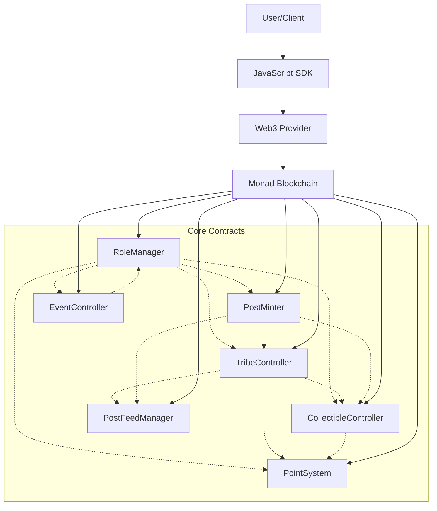
```mermaid
flowchart TD
    User[User/Client] --> SDK[JavaScript SDK]
    SDK --> Provider[Web3 Provider]
    Provider --> Blockchain[Monad Blockchain]
    
    subgraph Core Contracts
        RM[RoleManager]
        TC[TribeController]
        PS[PointSystem]
        CC[CollectibleController]
        PFM[PostFeedManager]
        PM[PostMinter]
        EC[EventController]
    end
    
    RM -.-> TC
    RM -.-> PS
    RM -.-> CC
    RM -.-> PM
    RM -.-> EC
    
    TC -.-> PS
    TC -.-> CC
    TC -.-> PFM
    
    CC -.-> PS
    
    PM -.-> TC
    PM -.-> CC
    PM -.-> PFM
    
    EC -.-> RM
    
    Blockchain --> RM
    Blockchain --> TC
    Blockchain --> PS
    Blockchain --> CC
    Blockchain --> PFM
    Blockchain --> PM
    Blockchain --> EC
```

**Key Components:**
- **RoleManager (RM)**: Central contract that manages permissions and access control across the system
- **TribeController (TC)**: Handles tribe creation, membership, and management
- **PointSystem (PS)**: Manages the platform's rewards and incentives
- **CollectibleController (CC)**: Manages NFTs and digital collectibles
- **PostFeedManager (PFM)**: Manages content feeds and discoverability
- **PostMinter (PM)**: Handles the creation of content as on-chain assets
- **EventController (EC)**: Manages events, ticketing, and attendance

The RoleManager is the central authority that connects to all other contracts, while each specialized contract interacts with others as needed to fulfill its responsibilities.

### SDK Architecture

The SDK provides a developer-friendly interface to interact with the blockchain contracts, abstracting away the complexity of direct blockchain interactions.

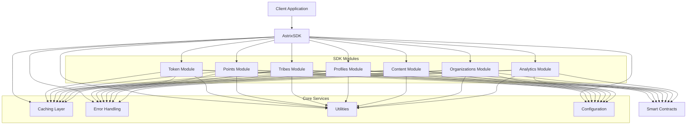
```mermaid
flowchart TD
    App[Client Application] --> SDK[AstrixSDK]
    
    subgraph SDK_Modules [SDK Modules]
        TM[Token Module]
        PTM[Points Module]
        TBM[Tribes Module]
        PFM[Profiles Module]
        CM[Content Module]
        OM[Organizations Module]
        AM[Analytics Module]
    end
    
    subgraph Core_Services [Core Services]
        Cache[Caching Layer]
        ErrorH[Error Handling]
        Utils[Utilities]
        Config[Configuration]
    end
    
    SDK --> TM
    SDK --> PTM
    SDK --> TBM
    SDK --> PFM
    SDK --> CM
    SDK --> OM
    SDK --> AM
    
    TM --> Contracts[Smart Contracts]
    PTM --> Contracts
    TBM --> Contracts
    PFM --> Contracts
    CM --> Contracts
    OM --> Contracts
    AM --> Contracts
    
    SDK --> Cache
    SDK --> ErrorH
    SDK --> Utils
    SDK --> Config
    
    TM --> Cache
    TM --> ErrorH
    TM --> Utils
    TM --> Config
    PTM --> Cache
    PTM --> ErrorH
    PTM --> Utils
    PTM --> Config
    TBM --> Cache
    TBM --> ErrorH
    TBM --> Utils
    TBM --> Config
    PFM --> Cache
    PFM --> ErrorH
    PFM --> Utils
    PFM --> Config
    CM --> Cache
    CM --> ErrorH
    CM --> Utils
    CM --> Config
    OM --> Cache
    OM --> ErrorH
    OM --> Utils
    OM --> Config
    AM --> Cache
    AM --> ErrorH
    AM --> Utils
    AM --> Config
```

**Key Components:**
- **SDK Modules**: Specialized modules that handle different functionality areas
  - **Token Module**: Handles cryptocurrency and token interactions
  - **Points Module**: Manages the platform's points and rewards system
  - **Tribes Module**: Manages community creation and membership
  - **Profiles Module**: Handles user profiles and identity
  - **Content Module**: Manages posts, comments, and content
  - **Organizations Module**: Handles organization management
  - **Analytics Module**: Provides insights and statistics

- **Core Services**: Shared utilities used by all modules
  - **Caching Layer**: Improves performance by storing frequently accessed data
  - **Error Handling**: Provides standardized error management
  - **Utilities**: Common functions and helpers
  - **Configuration**: System-wide settings and parameters

Each module interfaces directly with the blockchain contracts while utilizing shared core services for improved efficiency and consistency.

### User Authentication Flow

The authentication process allows users to connect their Web3 wallets to access the platform's features securely.

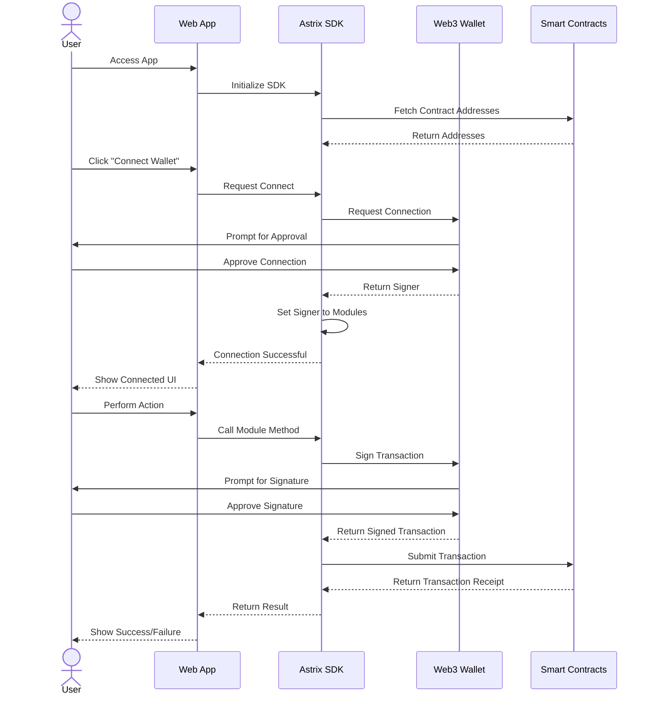
```mermaid
sequenceDiagram
    actor User
    participant App as Web App
    participant SDK as Astrix SDK
    participant Wallet as Web3 Wallet
    participant Contracts as Smart Contracts
    
    User->>App: Access App
    App->>SDK: Initialize SDK
    SDK->>Contracts: Fetch Contract Addresses
    Contracts-->>SDK: Return Addresses
    
    User->>App: Click "Connect Wallet"
    App->>SDK: Request Connect
    SDK->>Wallet: Request Connection
    Wallet->>User: Prompt for Approval
    User->>Wallet: Approve Connection
    Wallet-->>SDK: Return Signer
    SDK->>SDK: Set Signer to Modules
    SDK-->>App: Connection Successful
    App-->>User: Show Connected UI
    
    User->>App: Perform Action
    App->>SDK: Call Module Method
    SDK->>Wallet: Sign Transaction
    Wallet->>User: Prompt for Signature
    User->>Wallet: Approve Signature
    Wallet-->>SDK: Return Signed Transaction
    SDK->>Contracts: Submit Transaction
    Contracts-->>SDK: Return Transaction Receipt
    SDK-->>App: Return Result
    App-->>User: Show Success/Failure
```

**Process Description:**
1. User accesses the application in their browser
2. The app initializes the SDK and retrieves contract addresses
3. When the user clicks "Connect Wallet," the SDK requests a connection
4. The user approves the connection in their wallet
5. The wallet returns a signer that the SDK uses for transactions
6. When performing actions, the app calls SDK methods
7. For blockchain transactions, the user must sign with their wallet
8. The signed transaction is submitted to the contracts
9. Results are returned to the app for display to the user

This flow ensures secure, user-approved interactions with the blockchain while maintaining a seamless user experience.

### Cache Invalidation Flow

To maintain performance while ensuring data accuracy, the SDK implements a sophisticated caching system with smart invalidation rules.

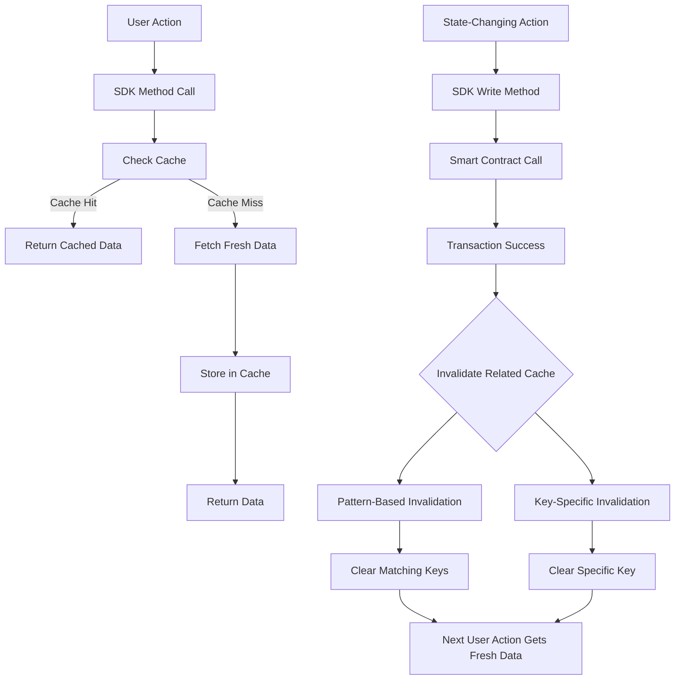
```mermaid
flowchart TD
    A[User Action] --> B[SDK Method Call]
    B --> C[Check Cache]
    
    C -->|Cache Hit| D[Return Cached Data]
    C -->|Cache Miss| E[Fetch Fresh Data]
    
    E --> F[Store in Cache]
    F --> G[Return Data]
    
    H[State-Changing Action] --> I[SDK Write Method]
    I --> J[Smart Contract Call]
    J --> K[Transaction Success]
    
    K --> L{Invalidate Related Cache}
    L --> M[Pattern-Based Invalidation]
    L --> N[Key-Specific Invalidation]
    
    M --> O[Clear Matching Keys]
    N --> P[Clear Specific Key]
    
    O --> Q[Next User Action Gets Fresh Data]
    P --> Q
```

**Process Description:**
1. For read operations, the SDK first checks its cache
2. If data is found (cache hit), it returns immediately
3. If not found (cache miss), it fetches fresh data from the blockchain
4. The fresh data is stored in the cache for future use
5. For write operations that change state, the SDK invalidates related cache entries
6. Cache invalidation uses both pattern-based (clearing categories) and key-specific approaches
7. This ensures the next user action will get fresh data if relevant state has changed

This caching strategy significantly improves performance while maintaining data consistency and accuracy.

### Tribe Creation and Management Flow

Tribes are the fundamental community units within the platform, with flexible access models and governance.

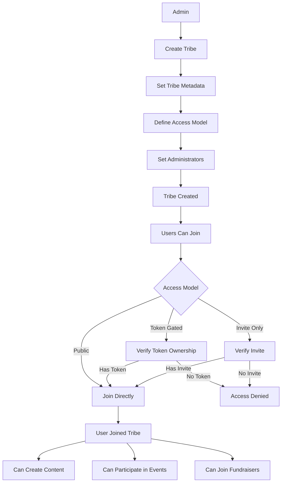
```mermaid
flowchart TD
    A[Admin] --> B[Create Tribe]
    B --> C[Set Tribe Metadata]
    C --> D[Define Access Model]
    D --> E[Set Administrators]
    
    E --> F[Tribe Created]
    F --> G[Users Can Join]
    
    G --> H{Access Model}
    H -->|Public| I[Join Directly]
    H -->|Token Gated| J[Verify Token Ownership]
    H -->|Invite Only| K[Verify Invite]
    
    J -->|Has Token| I
    J -->|No Token| L[Access Denied]
    
    K -->|Has Invite| I
    K -->|No Invite| L
    
    I --> M[User Joined Tribe]
    M --> N[Can Create Content]
    M --> O[Can Participate in Events]
    M --> P[Can Join Fundraisers]
```

**Process Description:**
1. An admin or authorized creator initiates tribe creation
2. They set metadata (name, description, image, etc.)
3. They define the access model (public, token-gated, or invite-only)
4. They assign administrators who will have management rights
5. The tribe is created on the blockchain
6. Users attempt to join based on the access model:
   - Public tribes: Join directly
   - Token-gated tribes: Must verify token ownership
   - Invite-only tribes: Must have a valid invitation
7. Once joined, users can participate in tribe activities:
   - Creating and interacting with content
   - Participating in events
   - Contributing to fundraisers

This flexible model allows communities to define their boundaries and governance while enabling rich interactions within the tribe.

### Event and Fundraiser Integration

Events and fundraisers are key activities within tribes that generate engagement and resources.

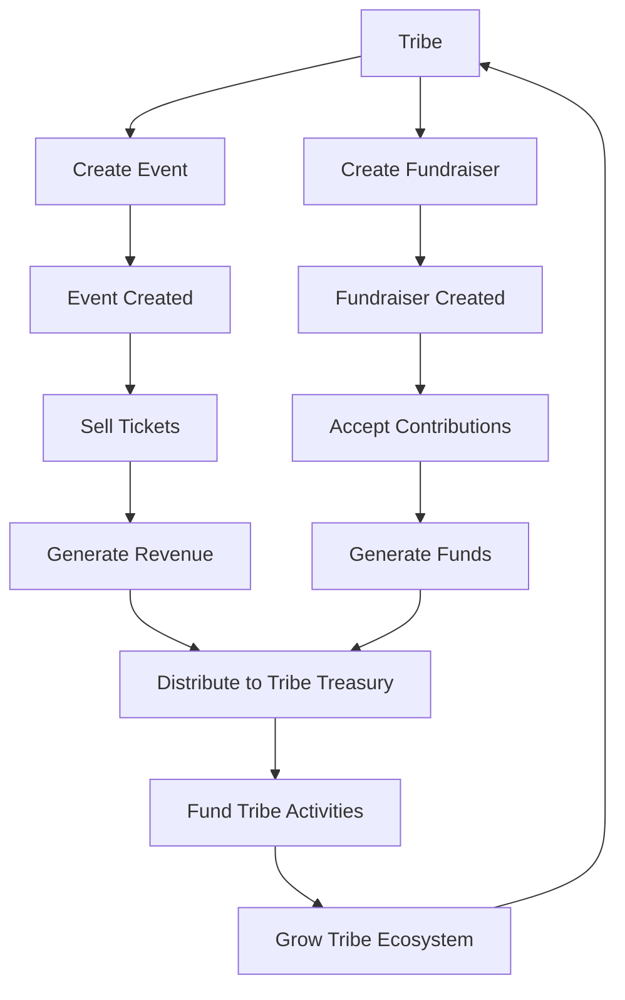
```mermaid
flowchart TD
    A[Tribe] --> B[Create Event]
    A --> C[Create Fundraiser]
    
    B --> D[Event Created]
    C --> E[Fundraiser Created]
    
    D --> F[Sell Tickets]
    E --> G[Accept Contributions]
    
    F --> H[Generate Revenue]
    G --> I[Generate Funds]
    
    H --> J[Distribute to Tribe Treasury]
    I --> J
    
    J --> K[Fund Tribe Activities]
    K --> L[Grow Tribe Ecosystem]
    L --> A
```

**Process Description:**
1. Tribes can host both events and fundraisers as community activities
2. Events sell tickets to generate revenue
3. Fundraisers accept contributions to generate funds
4. Both revenue streams flow into the tribe treasury
5. These resources fund ongoing tribe activities and growth initiatives
6. The cycle creates a sustainable ecosystem for the tribe's development

This integrated approach allows tribes to become self-sustaining communities with multiple funding mechanisms.

## Event User Flows

This section outlines the key user flows in the event management system, showing both the visual representation and explanatory descriptions of each flow.

### Setup Flow

**Description**: 
The setup flow establishes the fundamental contracts and roles required for the event management ecosystem. It deploys the necessary contracts (RoleManager, TribeController, PointSystem, CollectibleController, and EventController), assigns roles to different users, and creates a test tribe for hosting events.

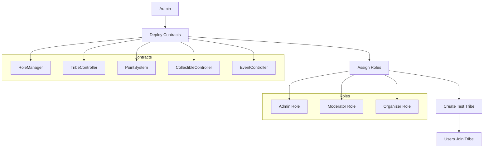
```mermaid
flowchart TD
    A[Admin] --> B[Deploy Contracts]
    B --> C[Assign Roles]
    C --> D[Create Test Tribe]
    D --> E[Users Join Tribe]

    subgraph ContractGroup [Contracts]
        B1[RoleManager]
        B2[TribeController]
        B3[PointSystem]
        B4[CollectibleController]
        B5[EventController]
    end

    subgraph RoleGroup [Roles]
        C1[Admin Role]
        C2[Moderator Role]
        C3[Organizer Role]
    end

    B --> B1
    B --> B2
    B --> B3
    B --> B4
    B --> B5
    
    C --> C1
    C --> C2
    C --> C3
```

**User Journey**:
1. Admin deploys all required contracts and establishes their relationships
2. Admin assigns specialized roles (admin, moderator, event organizer)
3. Admin creates a new tribe as a container for event activities
4. Regular users join the tribe to participate in events

### Physical Event Creation

**Description**:
This flow tests the basic creation of a physical event by an authorized organizer. It validates that users with the organizer role can successfully create events with parameters for in-person gatherings.

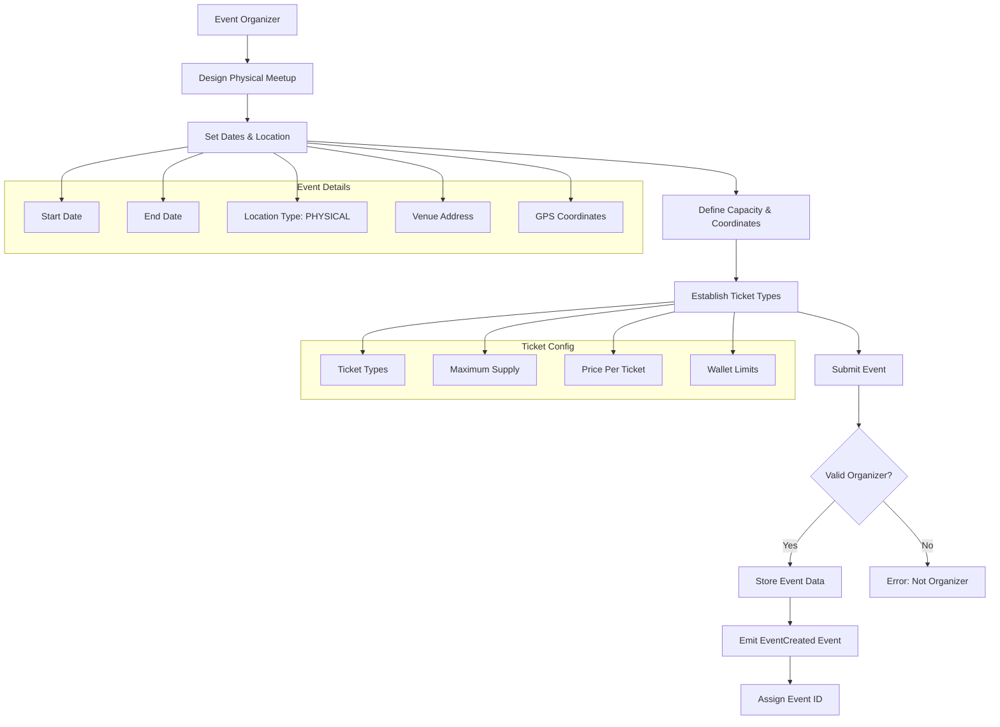
```mermaid
flowchart TD
    A[Event Organizer] --> B[Design Physical Meetup]
    B --> C[Set Dates & Location]
    C --> D[Define Capacity & Coordinates]
    D --> E[Establish Ticket Types]
    E --> F[Submit Event]
    
    F --> G{Valid Organizer?}
    G -->|Yes| H[Store Event Data]
    G -->|No| I[Error: Not Organizer]
    
    H --> J[Emit EventCreated Event]
    J --> K[Assign Event ID]

    subgraph EventDetails [Event Details]
        C1[Start Date]
        C2[End Date]
        C3[Location Type: PHYSICAL]
        C4[Venue Address]
        C5[GPS Coordinates]
    end

    subgraph TicketConfig [Ticket Config]
        E1[Ticket Types]
        E2[Maximum Supply]
        E3[Price Per Ticket]
        E4[Wallet Limits]
    end

    C --> C1
    C --> C2
    C --> C3
    C --> C4
    C --> C5
    
    E --> E1
    E --> E2
    E --> E3
    E --> E4
```

**User Journey**:
1. Event organizer designs a physical meetup with complete details
2. Organizer sets dates, location, coordinates, and capacity
3. Organizer establishes ticket types with pricing and limits
4. Organizer submits the event with metadata, maximum tickets, and base price
5. System validates and stores the event data
6. System emits an EventCreated event to notify tribe members
7. System assigns an event ID for future reference

### Event Metadata Validation

**Description**:
This flow tests the system's handling of various metadata formats and validation rules for event creation.

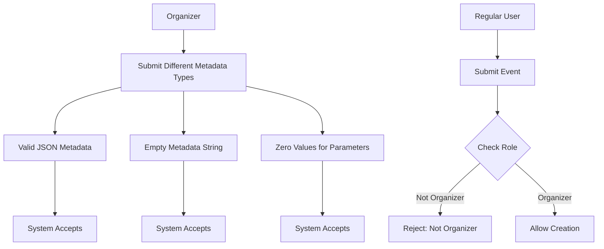
```mermaid
flowchart TD
    A[Organizer] --> B[Submit Different Metadata Types]
    B --> C1[Valid JSON Metadata]
    B --> C2[Empty Metadata String]
    B --> C3[Zero Values for Parameters]
    
    C1 --> D1[System Accepts]
    C2 --> D2[System Accepts]
    C3 --> D3[System Accepts]
    
    E[Regular User] --> F[Submit Event]
    F --> G{Check Role}
    G -->|Not Organizer| H[Reject: Not Organizer]
    G -->|Organizer| I[Allow Creation]
```

**User Journey**:
1. Organizer creates events with different metadata configurations
2. System accepts valid JSON metadata regardless of content
3. System handles empty metadata strings
4. System accepts various ticket and price configurations
5. System consistently enforces organizer role requirement

### Hybrid Event Setup

**Description**:
This flow demonstrates the system's ability to handle hybrid events that combine both physical and virtual attendance options.

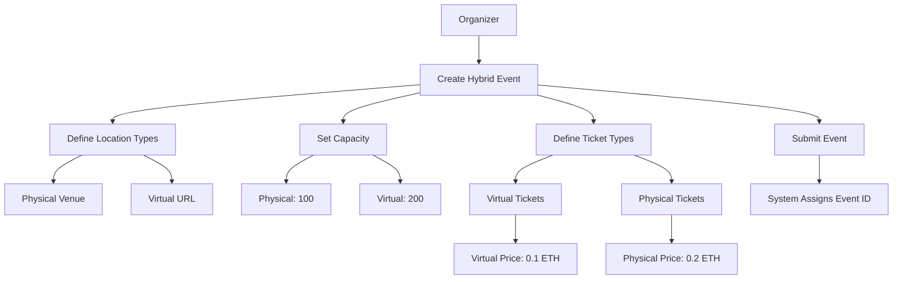
```mermaid
flowchart TD
    A[Organizer] --> B[Create Hybrid Event]
    
    B --> C[Define Location Types]
    C --> C1[Physical Venue]
    C --> C2[Virtual URL]
    
    B --> D[Set Capacity]
    D --> D1[Physical: 100]
    D --> D2[Virtual: 200]
    
    B --> E[Define Ticket Types]
    E --> E1[Virtual Tickets]
    E --> E2[Physical Tickets]
    
    E1 --> F1[Virtual Price: 0.1 ETH]
    E2 --> F2[Physical Price: 0.2 ETH]
    
    B --> G[Submit Event]
    G --> H[System Assigns Event ID]
```

**User Journey**:
1. Organizer creates a hybrid event with both physical and virtual components
2. Organizer defines both physical venue and virtual URL
3. Organizer sets different capacities for physical and virtual attendance
4. Organizer creates different ticket types with appropriate pricing
5. Physical tickets are priced higher due to venue costs and limited capacity
6. System processes the event creation and assigns an ID

### Standard Ticket Purchase

**Description**:
This flow tests the basic ticket purchasing functionality, allowing tribe members to secure their attendance at events.

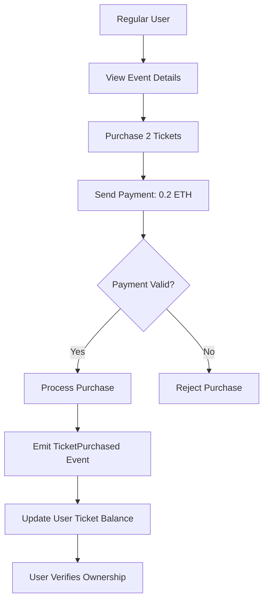
```mermaid
flowchart TD
    A[Regular User] --> B[View Event Details]
    B --> C[Purchase 2 Tickets]
    C --> D[Send Payment: 0.2 ETH]
    
    D --> E{Payment Valid?}
    E -->|Yes| F[Process Purchase]
    E -->|No| G[Reject Purchase]
    
    F --> H[Emit TicketPurchased Event]
    H --> I[Update User Ticket Balance]
    I --> J[User Verifies Ownership]
```

**User Journey**:
1. Regular user views the event details
2. User decides to purchase 2 tickets
3. User sends the exact payment amount for the tickets
4. System validates the payment amount
5. System processes the purchase and assigns tickets
6. System emits a TicketPurchased event
7. System updates the user's ticket balance
8. User can verify their ticket ownership

### Payment Processing and Refunds

**Description**:
This flow ensures the system properly handles overpayments by automatically refunding excess amounts to users.

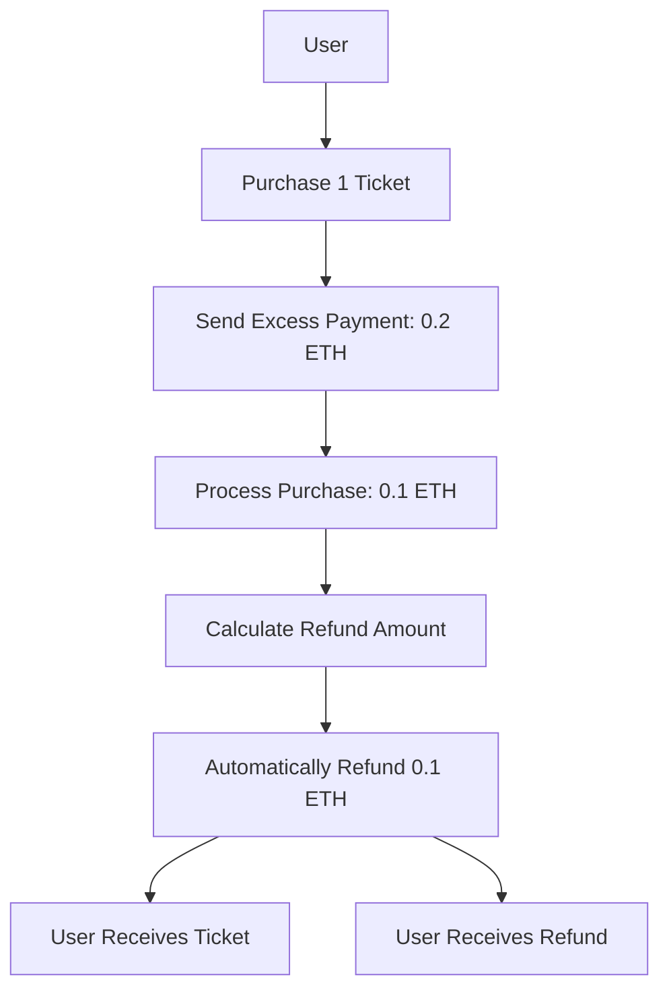
```mermaid
flowchart TD
    A[User] --> B[Purchase 1 Ticket]
    B --> C[Send Excess Payment: 0.2 ETH]
    
    C --> D[Process Purchase: 0.1 ETH]
    D --> E[Calculate Refund Amount]
    E --> F[Automatically Refund 0.1 ETH]
    
    F --> G[User Receives Ticket]
    F --> H[User Receives Refund]
```

**User Journey**:
1. User decides to purchase 1 ticket at 0.1 ETH
2. User accidentally sends 0.2 ETH (double the required amount)
3. System recognizes the overpayment
4. System processes the ticket purchase at the correct price
5. System automatically refunds the excess 0.1 ETH to the user
6. User receives both the ticket and the refund

### Ticket Supply Enforcement

**Description**:
This flow verifies the system enforces ticket supply limits to prevent overselling events.

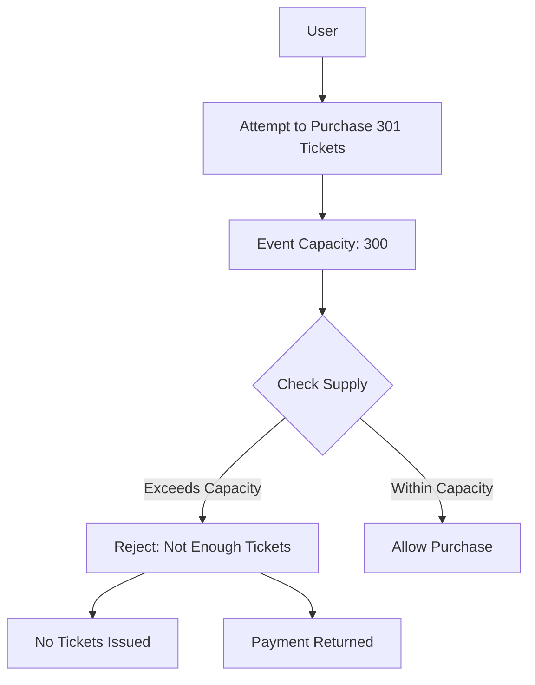
```mermaid
flowchart TD
    A[User] --> B[Attempt to Purchase 301 Tickets]
    B --> C[Event Capacity: 300]
    
    C --> D{Check Supply}
    D -->|Exceeds Capacity| E[Reject: Not Enough Tickets]
    D -->|Within Capacity| F[Allow Purchase]
    
    E --> G[No Tickets Issued]
    E --> H[Payment Returned]
```

**User Journey**:
1. Event has a maximum capacity of 300 tickets
2. User attempts to purchase 301 tickets (exceeding capacity)
3. System validates against the maximum supply
4. System rejects the purchase with a "Not enough tickets" error
5. No tickets are issued and payment is not processed

### Payment Validation

**Description**:
This flow ensures users must provide sufficient payment to purchase tickets, preventing underpayments.

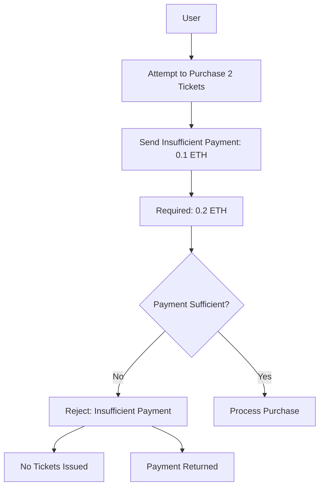
```mermaid
flowchart TD
    A[User] --> B[Attempt to Purchase 2 Tickets]
    B --> C[Send Insufficient Payment: 0.1 ETH]
    C --> D[Required: 0.2 ETH]
    
    D --> E{Payment Sufficient?}
    E -->|No| F[Reject: Insufficient Payment]
    E -->|Yes| G[Process Purchase]
    
    F --> H[No Tickets Issued]
    F --> I[Payment Returned]
```

**User Journey**:
1. User attempts to purchase 2 tickets (requiring 0.2 ETH)
2. User only sends 0.1 ETH (half the required amount)
3. System validates the payment against ticket price
4. System rejects the transaction with "Insufficient payment" error
5. No tickets are issued and payment is returned

### Ticket Transfer

**Description**:
This flow validates that ticket holders can transfer tickets to other users, with appropriate restrictions to prevent ticket scalping.

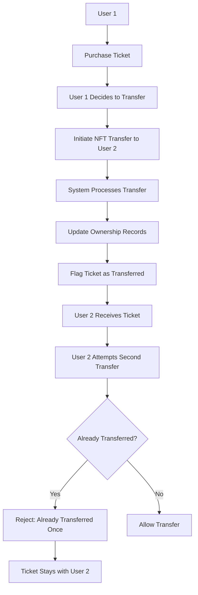
```mermaid
flowchart TD
    A[User 1] --> B[Purchase Ticket]
    B --> C[User 1 Decides to Transfer]
    C --> D[Initiate NFT Transfer to User 2]
    
    D --> E[System Processes Transfer]
    E --> F[Update Ownership Records]
    F --> G[Flag Ticket as Transferred]
    
    G --> H[User 2 Receives Ticket]
    H --> I[User 2 Attempts Second Transfer]
    
    I --> J{Already Transferred?}
    J -->|Yes| K[Reject: Already Transferred Once]
    J -->|No| L[Allow Transfer]
    
    K --> M[Ticket Stays with User 2]
```

**User Journey**:
1. User 1 purchases a ticket to an event
2. User 1 decides to transfer the ticket to User 2
3. User 1 initiates a ticket transfer using the NFT transfer functionality
4. System processes the transfer and updates ownership records
5. System flags the ticket as having been transferred once
6. User 2 receives the ticket and can verify ownership
7. User 2 attempts to transfer the ticket again
8. System blocks the second transfer with "Ticket already transferred once" error

### Event Metadata Updates

**Description**:
This flow tests the organizer's ability to update event details after creation, allowing for corrections or changes to the event plan.

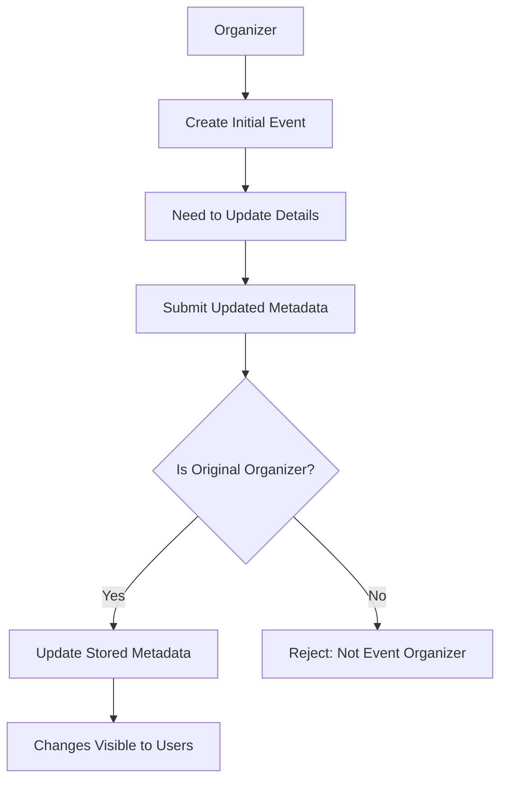
```mermaid
flowchart TD
    A[Organizer] --> B[Create Initial Event]
    B --> C[Need to Update Details]
    C --> D[Submit Updated Metadata]
    
    D --> E{Is Original Organizer?}
    E -->|Yes| F[Update Stored Metadata]
    E -->|No| G[Reject: Not Event Organizer]
    
    F --> H[Changes Visible to Users]
```

**User Journey**:
1. Organizer creates an event with initial details
2. Organizer later needs to update event information
3. Organizer submits updated metadata with new title, description, and venue
4. System validates the organizer's authority
5. System updates the stored metadata
6. Changes are immediately visible to potential attendees

### Event Cancellation

**Description**:
This flow enables organizers to cancel events when necessary, updating the event status for all stakeholders.

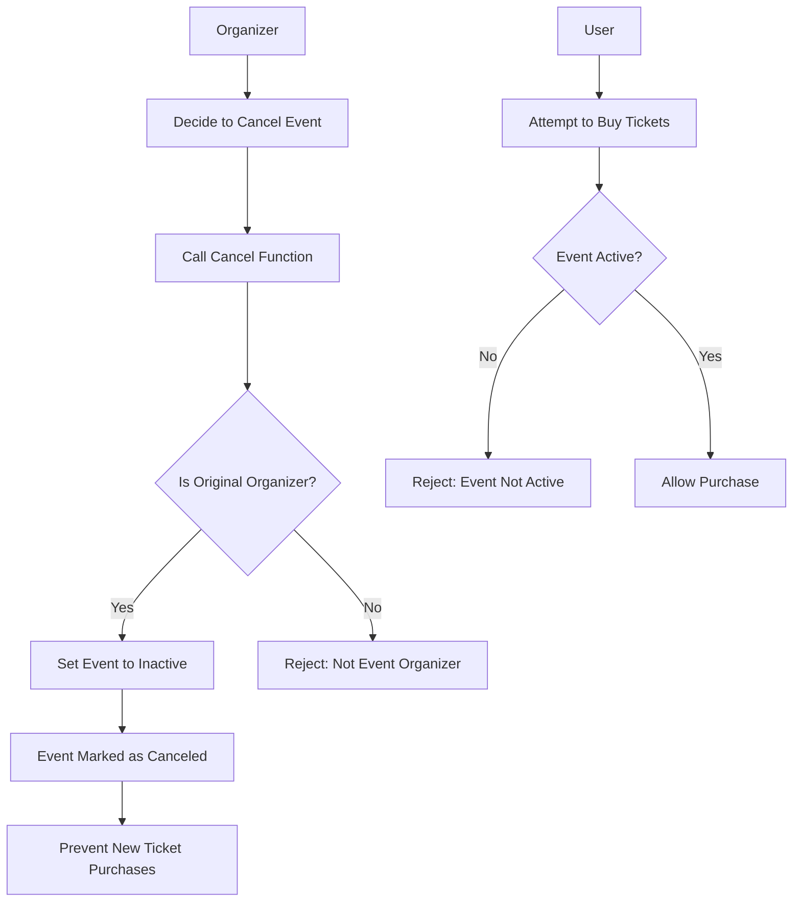
```mermaid
flowchart TD
    A[Organizer] --> B[Decide to Cancel Event]
    B --> C[Call Cancel Function]
    
    C --> D{Is Original Organizer?}
    D -->|Yes| E[Set Event to Inactive]
    D -->|No| F[Reject: Not Event Organizer]
    
    E --> G[Event Marked as Canceled]
    G --> H[Prevent New Ticket Purchases]
    
    I[User] --> J[Attempt to Buy Tickets]
    J --> K{Event Active?}
    K -->|No| L[Reject: Event Not Active]
    K -->|Yes| M[Allow Purchase]
```

**User Journey**:
1. Organizer decides to cancel a scheduled event
2. Organizer calls the cancel function for the specific event
3. System validates the organizer's authority
4. System updates the event status to inactive
5. Event remains in the system but is marked as canceled
6. Users attempting to purchase tickets are blocked
7. System rejects new purchases with "Event not active" error 

## Fundraiser User Flows

This section outlines the key user flows in the fundraiser system, showing both the visual representation and explanatory descriptions of each flow.

### Setup Flow

**Description**: 
The setup flow establishes the fundamental contracts and roles required for the fundraiser ecosystem. It deploys the necessary contracts (RoleManager, TribeController, PointSystem, CollectibleController, PostFeedManager, and PostMinter), assigns roles to different users, and creates a test tribe for hosting fundraisers.

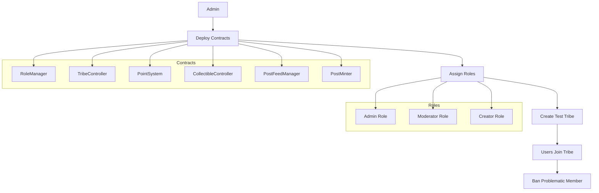
```mermaid
flowchart TD
    A[Admin] --> B[Deploy Contracts]
    B --> C[Assign Roles]
    C --> D[Create Test Tribe]
    D --> E[Users Join Tribe]
    E --> F[Ban Problematic Member]

    subgraph ContractGroup [Contracts]
        B1[RoleManager]
        B2[TribeController]
        B3[PointSystem]
        B4[CollectibleController]
        B5[PostFeedManager]
        B6[PostMinter]
    end

    subgraph RoleGroup [Roles]
        C1[Admin Role]
        C2[Moderator Role]
        C3[Creator Role]
    end

    B --> B1
    B --> B2
    B --> B3
    B --> B4
    B --> B5
    B --> B6
    
    C --> C1
    C --> C2
    C --> C3
```

**User Journey**:
1. Admin deploys all required contracts and establishes their relationships
2. Admin assigns specialized roles (admin, moderator, fundraiser creator)
3. Admin creates a new tribe as a container for fundraising activities
4. Various users join the tribe (fundraiser creator, contributors)
5. Admin bans a problematic member to test access controls

### Standard Fundraiser Creation

**Description**:
This flow tests the basic creation of a fundraiser by an authorized creator. It validates that users with the creator role can successfully create fundraisers with standard parameters and that the metadata is correctly stored.

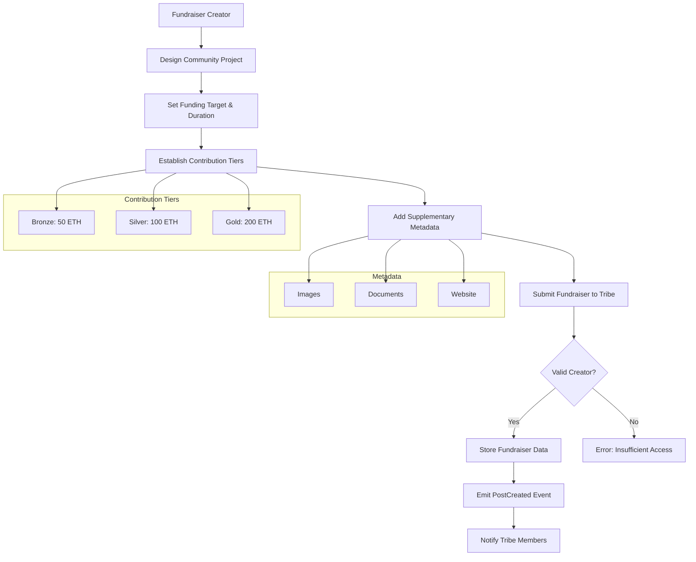
```mermaid
flowchart TD
    A[Fundraiser Creator] --> B[Design Community Project]
    B --> C[Set Funding Target & Duration]
    C --> D[Establish Contribution Tiers]
    D --> E[Add Supplementary Metadata]
    E --> F[Submit Fundraiser to Tribe]
    
    F --> G{Valid Creator?}
    G -->|Yes| H[Store Fundraiser Data]
    G -->|No| I[Error: Insufficient Access]
    
    H --> J[Emit PostCreated Event]
    J --> K[Notify Tribe Members]

    subgraph ContributionTiers [Contribution Tiers]
        D1[Bronze: 50 ETH]
        D2[Silver: 100 ETH]
        D3[Gold: 200 ETH]
    end

    subgraph MetadataItems [Metadata]
        E1[Images]
        E2[Documents]
        E3[Website]
    end

    D --> D1
    D --> D2
    D --> D3
    
    E --> E1
    E --> E2
    E --> E3
```

**User Journey**:
1. Fundraiser creator designs a community garden project with complete details
2. Creator sets a funding target of 1000 ETH with a 30-day duration
3. Creator establishes three contribution tiers (Bronze: 50 ETH, Silver: 100 ETH, Gold: 200 ETH)
4. Creator adds supplementary metadata (images, documents, website)
5. Creator submits the fundraiser to the tribe
6. System validates and stores the fundraiser data
7. System emits a PostCreated event to notify tribe members

### Multi-Currency Fundraiser Creation

**Description**:
This flow ensures creators can establish fundraisers using different currency options (ETH, USDC, TRIBE_TOKEN), providing flexibility in how contributors can support initiatives.

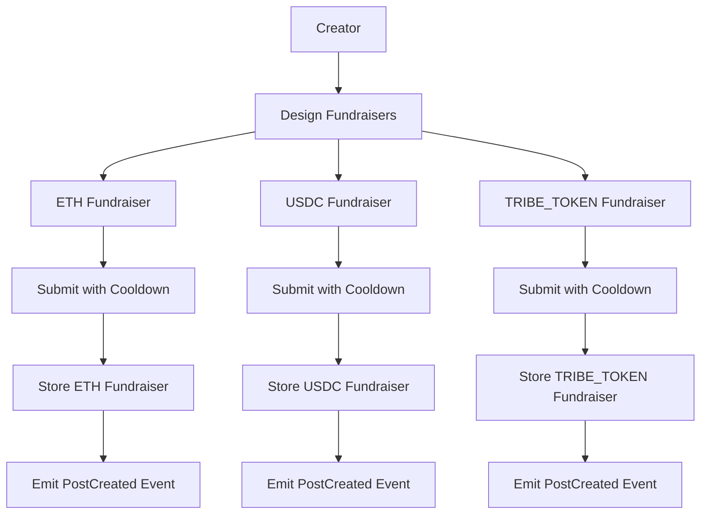
```mermaid
flowchart TD
    A[Creator] --> B[Design Fundraisers]
    B --> C1[ETH Fundraiser]
    B --> C2[USDC Fundraiser]
    B --> C3[TRIBE_TOKEN Fundraiser]
    
    C1 --> D1[Submit with Cooldown]
    C2 --> D2[Submit with Cooldown]
    C3 --> D3[Submit with Cooldown]
    
    D1 --> E1[Store ETH Fundraiser]
    D2 --> E2[Store USDC Fundraiser]
    D3 --> E3[Store TRIBE_TOKEN Fundraiser]
    
    E1 --> F1[Emit PostCreated Event]
    E2 --> F2[Emit PostCreated Event]
    E3 --> F3[Emit PostCreated Event]
```

**User Journey**:
1. Creator designs three separate fundraisers with identical parameters
2. Each fundraiser specifies a different currency (ETH, USDC, TRIBE_TOKEN)
3. Creator submits each fundraiser with appropriate cooldown periods between submissions
4. System validates and stores each fundraiser with its specific currency
5. System emits a PostCreated event for each submission

### Time-Flexible Fundraiser Creation

**Description**:
This flow tests the system's ability to handle fundraisers with different time horizons, from short one-week campaigns to long three-month initiatives.

```mermaid
flowchart TD
    A[Creator] --> B[Design Fundraisers]
    B --> C1[One-Week Campaign]
    B --> C2[One-Month Campaign]
    B --> C3[Three-Month Campaign]
    
    C1 --> D1[Submit with Cooldown]
    C2 --> D2[Submit with Cooldown]
    C3 --> D3[Submit with Cooldown]
    
    D1 --> E1[Store 7-Day Fundraiser]
    D2 --> E2[Store 30-Day Fundraiser]
    D3 --> E3[Store 90-Day Fundraiser]
    
    E1 --> F1[Emit PostCreated Event]
    E2 --> F2[Emit PostCreated Event]
    E3 --> F3[Emit PostCreated Event]
```

**User Journey**:
1. Creator designs three fundraisers with identical parameters except duration
2. Creator sets different timeframes: 7 days (1 week), 30 days (1 month), and 90 days (3 months)
3. Creator submits each fundraiser with appropriate cooldown periods
4. System validates and stores each fundraiser with its specific duration
5. System emits a PostCreated event for each submission

### Basic Contribution Tracking

**Description**:
This flow tests the system's ability to track contributions to fundraisers through user interactions, specifically using likes as a proxy for contributions in the test environment.

```mermaid
flowchart TD
    A[Fundraiser Creator] --> B[Create Test Fundraiser]
    B --> C[System Assigns ID]
    C --> D[Contributor Interacts]
    D --> E[System Records Interaction]
    E --> F[Verify Interaction Count]
```

**User Journey**:
1. Fundraiser creator establishes a test fundraiser with multiple tiers
2. System creates the fundraiser and assigns it an ID
3. Contributor 1 interacts with the fundraiser post (simulating a contribution)
4. System records the interaction/contribution
5. System verifies the interaction count is updated correctly

### Access Control for Contributions

**Description**:
This flow verifies that banned members cannot interact with or contribute to fundraisers, maintaining the integrity of the contribution system.

```mermaid
flowchart TD
    A[Create Fundraiser] --> B[Banned Member Attempts Interaction]
    B --> C{Check Member Status}
    C -->|Banned| D[Reject with InsufficientAccess]
    C -->|Active| E[Allow Interaction]
    D --> F[Interaction Count Unchanged]
    E --> G[Increment Interaction Count]
```

**User Journey**:
1. Fundraiser creator establishes a test fundraiser
2. A banned member attempts to interact with the fundraiser
3. System identifies the banned status of the user
4. System rejects the interaction attempt with "InsufficientAccess" error
5. Fundraiser interaction counts remain unchanged

### Deleted Fundraiser Protection

**Description**:
This flow tests the system's handling of deleted fundraisers, ensuring users cannot interact with or contribute to fundraisers that have been removed.

```mermaid
flowchart TD
    A[Create Fundraiser] --> B[Creator Deletes Fundraiser]
    B --> C[Mark as Deleted]
    C --> D[Contributor Attempts Interaction]
    D --> E{Check Fundraiser Status}
    E -->|Deleted| F[Reject with PostDeleted]
    E -->|Active| G[Allow Interaction]
    F --> H[No Interactions Recorded]
```

**User Journey**:
1. Fundraiser creator establishes a test fundraiser
2. Creator later decides to delete the fundraiser
3. System marks the fundraiser as deleted
4. Contributor attempts to interact with the deleted fundraiser
5. System rejects the interaction with "PostDeleted" error
6. No interactions are recorded for the deleted fundraiser

### Frontend Validation Rules

**Description**:
While not actual test cases, these validation rules should be implemented in the frontend to ensure a smooth user experience and prevent invalid data submission.

```mermaid
flowchart TD
    A[Frontend Validations] --> B[Date Validations]
    A --> C[Amount Validations]
    A --> D[Tier Validations]
    A --> E[Currency Validations]
    
    subgraph DateRules [Date Rules]
        B1[Start Date in Future]
        B2[Duration Between 1 Week - 3 Months]
    end
    
    subgraph AmountRules [Amount Rules]
        C1[Target > 0]
        C2[Target Under Max Limit]
    end
    
    subgraph TierRules [Tier Rules]
        D1[At Least One Tier]
        D2[Amounts in Ascending Order]
        D3[No Duplicate Names]
        D4[All Amounts > 0]
    end
    
    subgraph CurrencyRules [Currency Rules]
        E1[From Supported List]
        E2[Valid Contract if Token]
    end
    
    B --> B1
    B --> B2
    
    C --> C1
    C --> C2
    
    D --> D1
    D --> D2
    D --> D3
    D --> D4
    
    E --> E1
    E --> E2
```

**Validation Categories**:
1. **Date Validations**:
   - Start date must be in the future
   - Duration must be between 1 week and 3 months

2. **Amount Validations**:
   - Target amount must be > 0
   - Target amount must be reasonable (platform-specific max)

3. **Tier Validations**:
   - At least one tier required
   - Tier amounts must be in ascending order
   - No duplicate tier names
   - Tier amounts must be > 0

4. **Currency Validations**:
   - Currency must be from supported list
   - If token, must be valid contract address

These frontend validations complement the contract-level validations to create a seamless and error-resistant user experience.

## Conclusion

This comprehensive documentation combines the system architecture and key user flows for the Tribes by Astrix platform. The diagrams and explanatory text provide a clear understanding of how the system components interact and how users navigate through different processes.

### Key Takeaways

1. **Modular Architecture**: The system uses a modular architecture with specialized contracts and SDK modules to handle different aspects of functionality, promoting maintainability and extensibility.

2. **Role-Based Access Control**: A robust role-based permission system ensures that only authorized users can perform sensitive operations, maintaining system integrity.

3. **Flexible Community Model**: The tribe-based community model supports different access models and governance structures, enabling diverse community formations.

4. **Comprehensive Event System**: Events support both physical and virtual attendance with flexible ticket types and pricing, along with mechanisms for transfers and refunds.

5. **Versatile Fundraising**: Fundraisers can be configured with different currencies, durations, and contribution tiers to suit various community needs.

6. **Strong Validation**: Both contract-level and recommended frontend validations ensure data integrity and a smooth user experience.

The flows documented here serve as both a reference for understanding the system and a guide for testing to ensure all functionality works as expected. They represent the current state of the Tribes by Astrix platform and should be updated as the system evolves. 