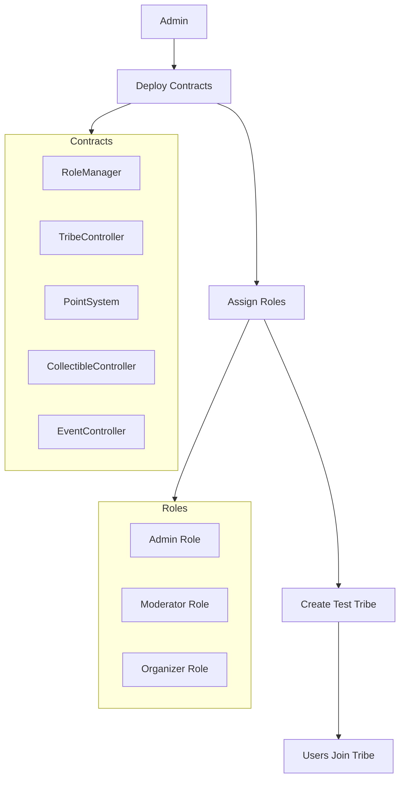
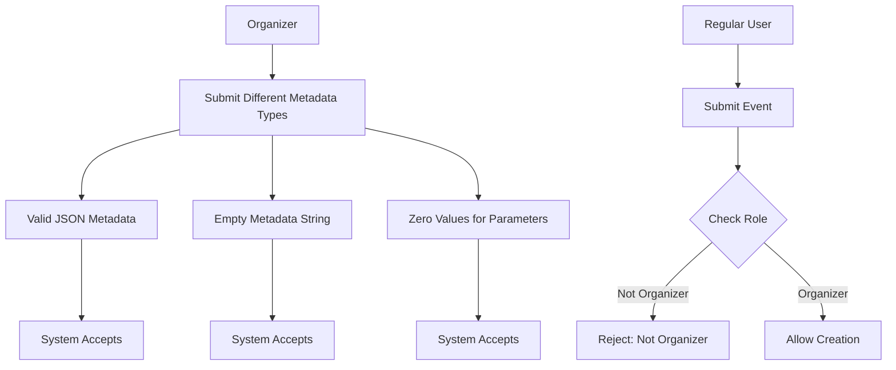
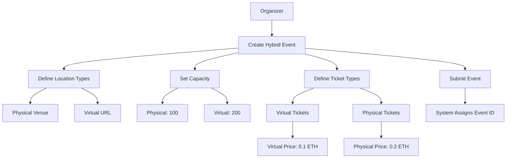
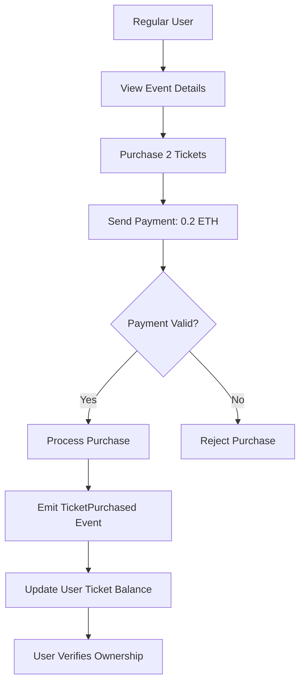
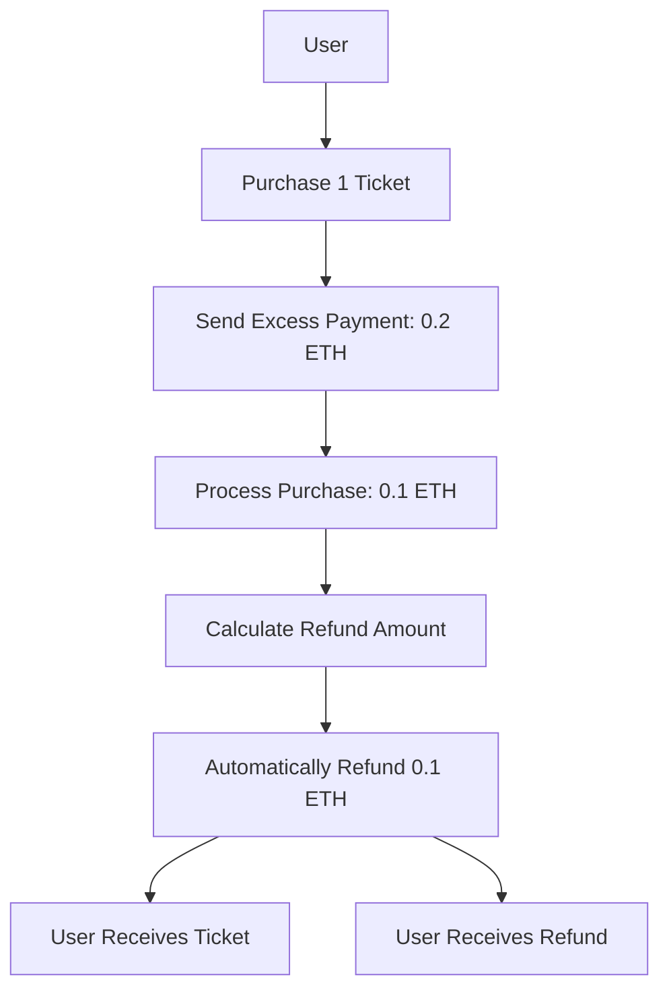
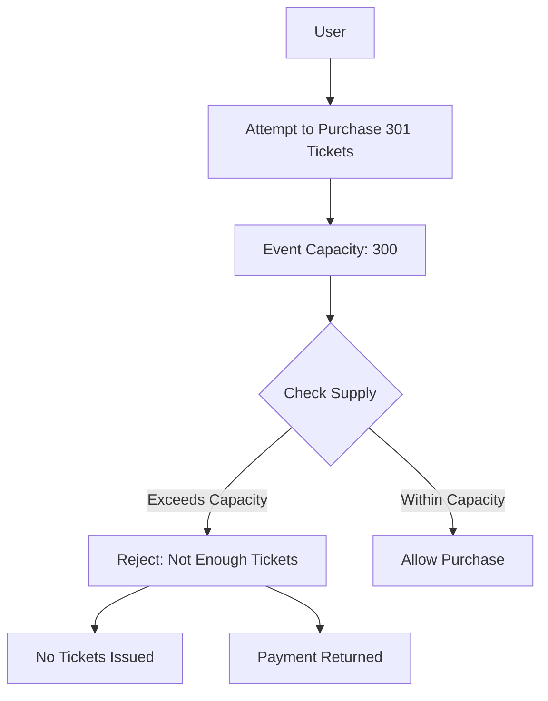
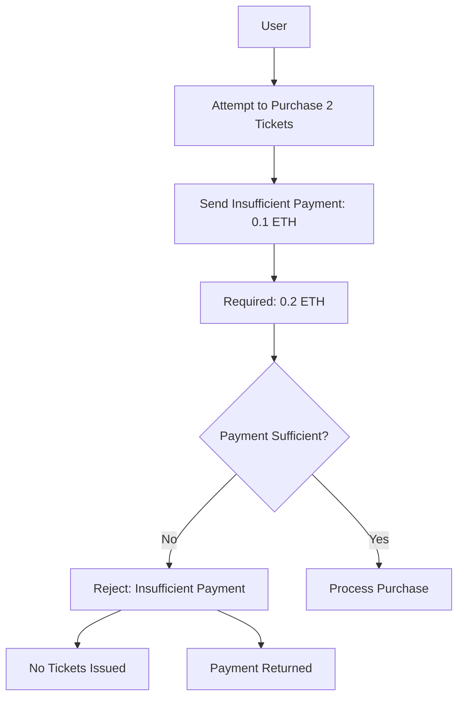
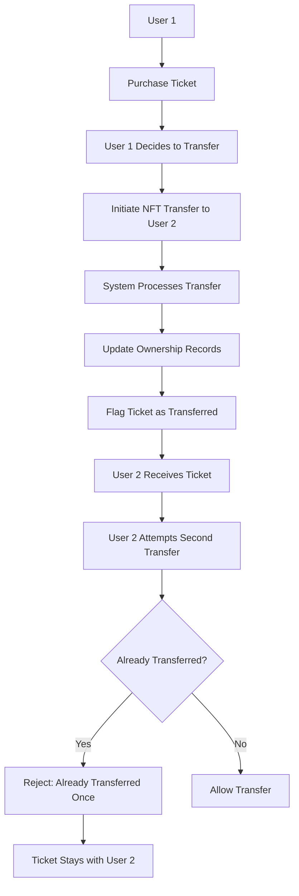
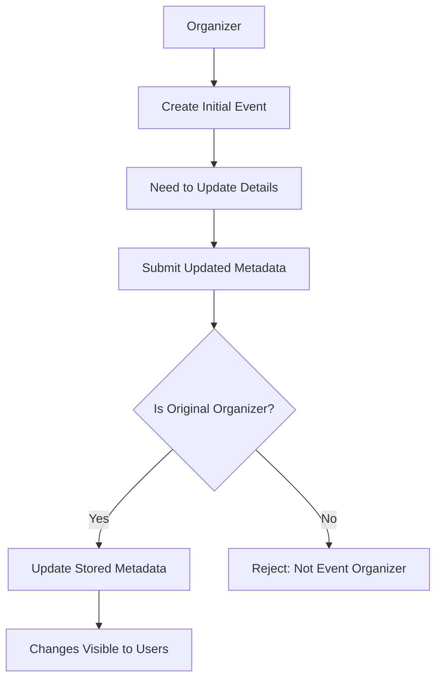
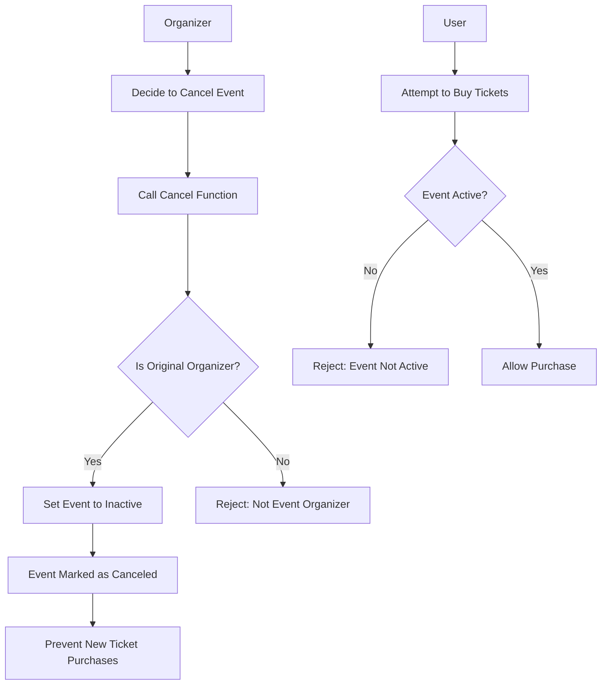

# Event Flow Diagrams

This document provides visual representations of the key user flows in the event management system using Mermaid diagrams.

## Setup Flow



## Event Creation Flows

### Physical Event Creation

```mermaid
flowchart TD
    A[Event Organizer] --> B[Design Physical Meetup]
    B --> C[Set Dates & Location]
    C --> D[Define Capacity & Coordinates]
    D --> E[Establish Ticket Types]
    E --> F[Submit Event]
    
    F --> G{Valid Organizer?}
    G -->|Yes| H[Store Event Data]
    G -->|No| I[Error: Not Organizer]
    
    H --> J[Emit EventCreated Event]
    J --> K[Assign Event ID]

    subgraph Event Details
        C1[Start Date]
        C2[End Date]
        C3[Location Type: PHYSICAL]
        C4[Venue Address]
        C5[GPS Coordinates]
    end

    subgraph Ticket Config
        E1[Ticket Types]
        E2[Maximum Supply]
        E3[Price Per Ticket]
        E4[Wallet Limits]
    end

    C --> Event Details
    E --> Ticket Config
```

### Event Metadata Validation



## Ticket Purchase and Management Flows

### Hybrid Event Setup



### Standard Ticket Purchase



### Payment Processing and Refunds



### Ticket Supply Enforcement



### Payment Validation



### Ticket Transfer



## Event Management Flows

### Event Metadata Updates



### Event Cancellation

