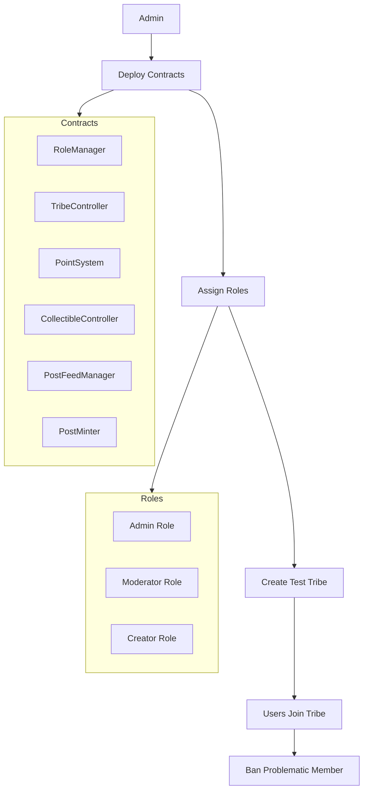
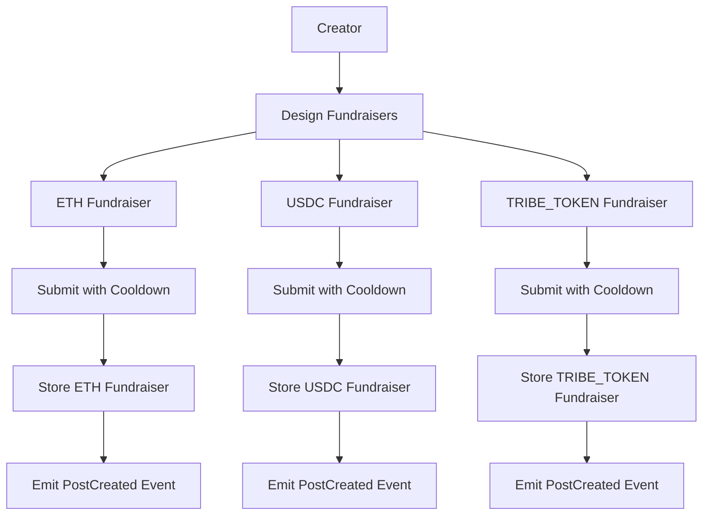
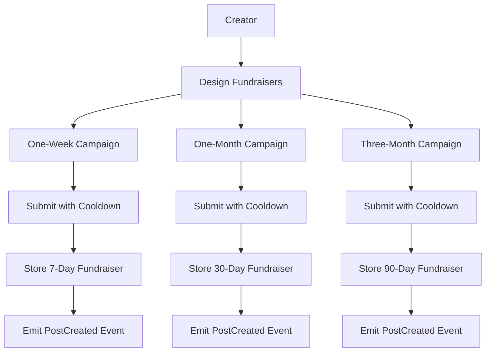
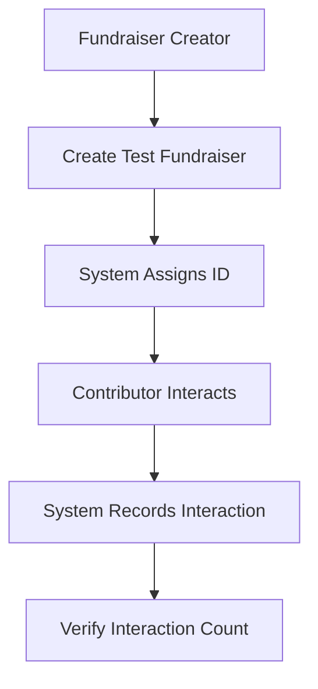
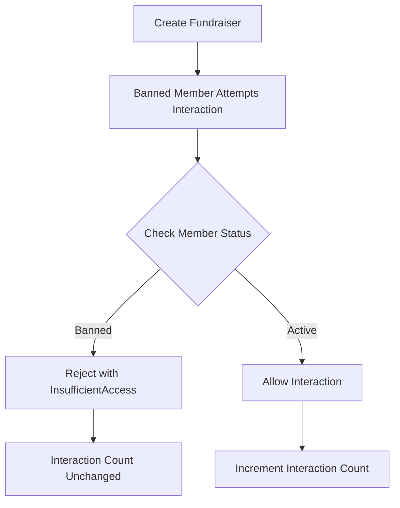
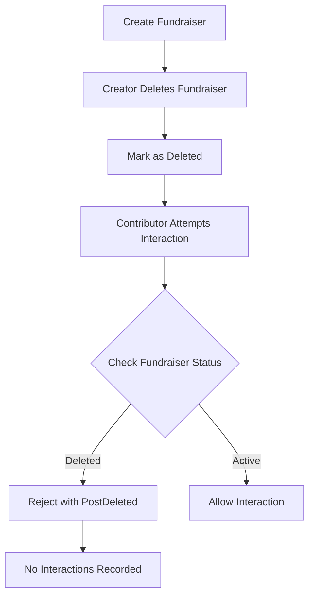

# Fundraiser Flow Diagrams

This document provides visual representations of the key user flows in the fundraiser system using Mermaid diagrams.

## Setup Flow



## Fundraiser Creation Flows

### Standard Fundraiser Creation

```mermaid
flowchart TD
    A[Fundraiser Creator] --> B[Design Community Project]
    B --> C[Set Funding Target & Duration]
    C --> D[Establish Contribution Tiers]
    D --> E[Add Supplementary Metadata]
    E --> F[Submit Fundraiser to Tribe]
    
    F --> G{Valid Creator?}
    G -->|Yes| H[Store Fundraiser Data]
    G -->|No| I[Error: Insufficient Access]
    
    H --> J[Emit PostCreated Event]
    J --> K[Notify Tribe Members]

    subgraph Contribution Tiers
        D1[Bronze: 50 ETH]
        D2[Silver: 100 ETH]
        D3[Gold: 200 ETH]
    end

    subgraph Metadata
        E1[Images]
        E2[Documents]
        E3[Website]
    end

    D --> Contribution Tiers
    E --> Metadata
```

### Multi-Currency Fundraiser Creation



### Time-Flexible Fundraiser Creation



## Contribution Flows

### Basic Contribution Tracking



### Access Control for Contributions



### Deleted Fundraiser Protection



## Frontend Validation Rules

```mermaid
flowchart TD
    A[Frontend Validations] --> B[Date Validations]
    A --> C[Amount Validations]
    A --> D[Tier Validations]
    A --> E[Currency Validations]
    
    subgraph Date Rules
        B1[Start Date in Future]
        B2[Duration Between 1 Week - 3 Months]
    end
    
    subgraph Amount Rules
        C1[Target > 0]
        C2[Target Under Max Limit]
    end
    
    subgraph Tier Rules
        D1[At Least One Tier]
        D2[Amounts in Ascending Order]
        D3[No Duplicate Names]
        D4[All Amounts > 0]
    end
    
    subgraph Currency Rules
        E1[From Supported List]
        E2[Valid Contract if Token]
    end
    
    B --> Date Rules
    C --> Amount Rules
    D --> Tier Rules
    E --> Currency Rules
``` 