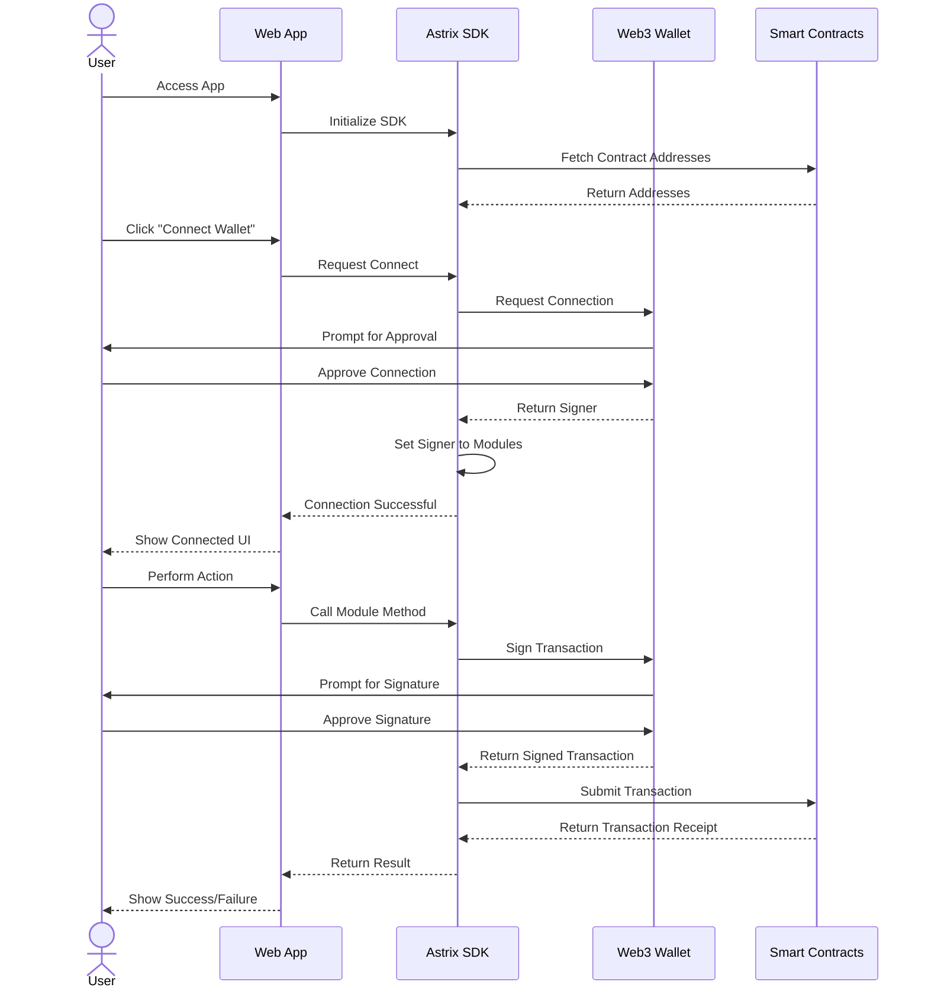
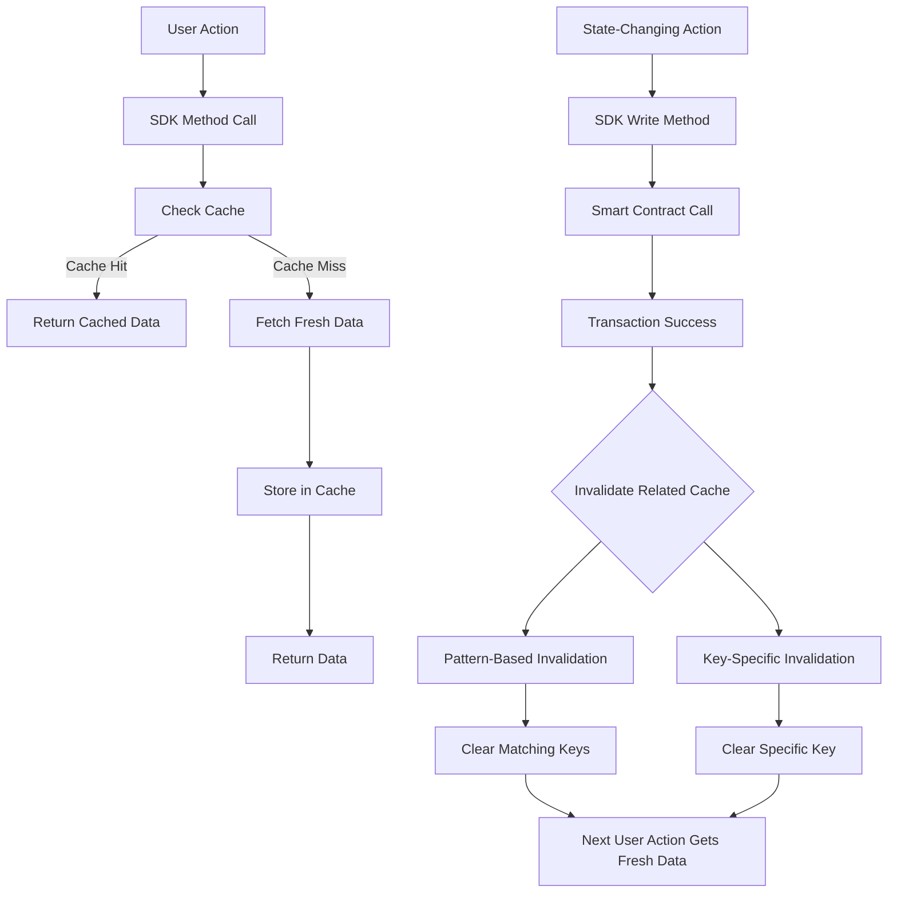
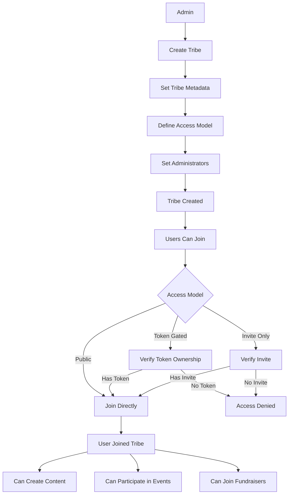
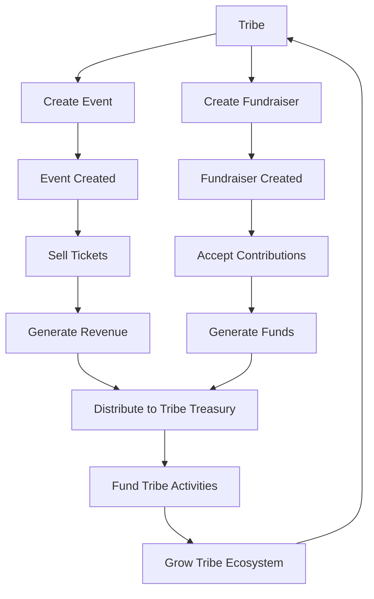

# System Architecture

This document provides a visual representation of the Tribes by Astrix system architecture using Mermaid diagrams, showing how the various components interact.

## Contract Architecture

```mermaid
flowchart TD
    User[User/Client] --> SDK[JavaScript SDK]
    SDK --> Provider[Web3 Provider]
    Provider --> Blockchain[Monad Blockchain]
    
    subgraph Core Contracts
        RM[RoleManager]
        TC[TribeController]
        PS[PointSystem]
        CC[CollectibleController]
        PFM[PostFeedManager]
        PM[PostMinter]
        EC[EventController]
    end
    
    RM -.-> TC
    RM -.-> PS
    RM -.-> CC
    RM -.-> PM
    RM -.-> EC
    
    TC -.-> PS
    TC -.-> CC
    TC -.-> PFM
    
    CC -.-> PS
    
    PM -.-> TC
    PM -.-> CC
    PM -.-> PFM
    
    EC -.-> RM
    
    Blockchain --> Core Contracts
```

## SDK Architecture

```mermaid
flowchart TD
    App[Client Application] --> SDK[AstrixSDK]
    
    subgraph SDK Modules
        TM[Token Module]
        PTM[Points Module]
        TBM[Tribes Module]
        PFM[Profiles Module]
        CM[Content Module]
        OM[Organizations Module]
        AM[Analytics Module]
    end
    
    SDK --> SDK Modules
    SDK Modules --> Contracts[Smart Contracts]
    
    subgraph Core Services
        Cache[Caching Layer]
        ErrorH[Error Handling]
        Utils[Utilities]
        Config[Configuration]
    end
    
    SDK --> Core Services
    SDK Modules --> Core Services
```

## User Authentication Flow



## Cache Invalidation Flow



## Tribe Creation and Management Flow



## Event and Fundraiser Integration

