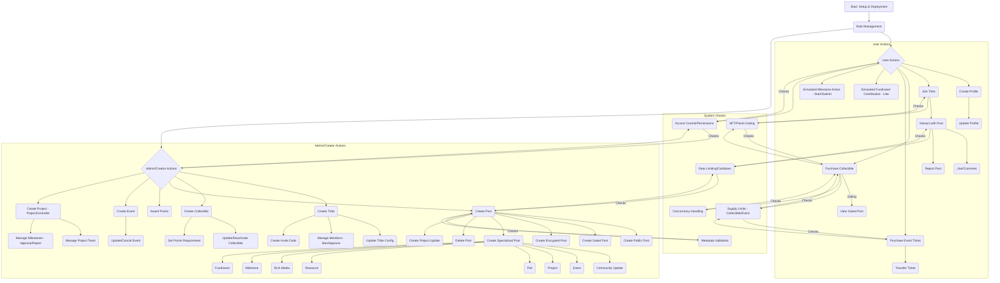

# Comprehensive User Journey Tests

This document outlines the combined user flows simulated and verified across the various journey tests in this directory. All tests are confirmed to be passing.

## Overall Flow

The tests cover a wide range of user interactions within a decentralized social platform, simulating the lifecycle from initial setup and user onboarding to advanced content creation, community management, and feature-specific interactions like events, projects, and fundraisers.

## Key Flows Tested

1.  **Setup & Roles:** Deployment of all core contracts (`RoleManager`, `TribeController`, `ProfileNFTMinter`, `PostMinter`, `CollectibleController`, `PointSystem`, `EventController`, `ProjectController`, `PostFeedManager`) and assignment of granular roles (Admin, Moderator, Creator, Organizer, Reviewer, etc.).
2.  **User Profiles:** Creation, validation (username rules, duplicates), metadata updates, and ownership verification.
3.  **Tribe Lifecycle:**
    *   **Creation:** Public, Private (with fee), Invite-Only, Invite Code, NFT-Gated tribes.
    *   **Configuration:** Updating join type, fees, NFT requirements, metadata, admin lists.
    *   **Membership:** Joining (direct, request/approval, invite code, NFT gate), banning/unbanning members, checking status. Access control enforcement for management actions.
4.  **Collectibles:**
    *   **Creation:** Standard, free, points-required, limited supply.
    *   **Management:** Deactivation, updates (implicitly via PostMinter gating).
    *   **Claiming:** Purchasing with ETH, claiming for free, claiming with points. Enforcement of supply limits, points requirements, and active status. Concurrent claim handling tested.
5.  **Posts:**
    *   **Creation:** Basic text, with attachments, encrypted, gated (by collectible), Community Updates, Events, Projects, Polls, Resources, Rich Media, Milestones, Fundraisers. Validation of metadata format and required fields. Rate limiting enforcement.
    *   **Interaction:** Liking, commenting, reporting. Prevention of self-interaction and duplicate reports.
    *   **Management:** Deletion by creator/moderator. Access control checks (banned users, non-members).
    *   **Gating Access:** Verifying users with required collectibles can view gated posts.
    *   **Encrypted Access:** Authorizing viewers for encrypted posts.
6.  **Feeds:** Retrieving posts by tribe and by user, verifying pagination and chronological order.
7.  **Events (`EventController`):**
    *   **Creation:** Physical, virtual, hybrid events with detailed metadata, capacity, and ticket types/pricing.
    *   **Tickets:** Purchase (handling payment/refunds), supply limit enforcement, transfer (with re-transfer prevention).
    *   **Management:** Metadata updates, event cancellation (preventing further ticket sales). Role enforcement (only organizers manage events).
8.  **Projects & Grants (`PostMinter` Project type & `ProjectController`):**
    *   **Creation:** Creating "PROJECT" posts via `PostMinter` with budget, duration, milestones, team roles/permissions. Validating and creating corresponding `ProjectController` entries.
    *   **Updates:** Creating "PROJECT_UPDATE" posts for status changes and milestone submissions/reviews.
    *   **Team Management (`ProjectController`):** Adding/removing members (creator only).
    *   **Milestone Management (`ProjectController`):** Starting milestones, submitting deliverables, reviewer approval/rejection. Dependency checking enforced. Access control for team members vs. reviewers.
9.  **Fundraisers (`PostMinter` Fundraiser type):**
    *   **Creation:** Defining target amounts, currencies, durations, contribution slabs.
    *   **Contribution:** Simulated via post interactions (likes). Tracking interactions. Access control (banned members). Handling deleted fundraisers.
10. **Points System:** Awarding points for engagement, using points as a requirement for claiming collectibles.
11. **Concurrency & Scalability:** Simulating multiple users claiming collectibles concurrently, testing supply limit enforcement under load.
12. **Error Handling:** Explicit tests for invalid inputs, insufficient permissions, rate limits, unmet requirements (fees, NFTs, points), duplicate actions, interacting with deleted content, etc., across various modules.

This comprehensive suite ensures that the core user journeys and interactions function correctly according to the defined rules and access controls. 